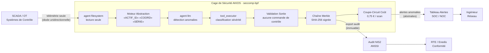

<header class="post-header">
  <div class="post-meta">10 Février 2026 · Ingénierie / Énergie · 5 min de lecture</div>
  <h1>IA pour l'Énergie : Sécuriser les Infrastructures Critiques avec AKIOS</h1>
</header>

<div class="post-content">

Les opérateurs énergétiques gèrent des réseaux électriques, des pipelines et des installations de production qui desservent des millions de personnes. L'IA peut optimiser l'équilibrage de charge, prédire les pannes et détecter les cybermenaces. Le problème : **un agent IA compromis connecté aux systèmes OT pourrait causer des dommages physiques ou perturber la fourniture d'électricité à des régions entières.**

AKIOS résout cela avec la Cage de Sécurité : un runtime éphémère et sandboxé où l'IA analyse les données du réseau — sans accès direct aux systèmes de contrôle.

## Le Problème

Le défi du secteur énergétique est unique : contrairement à la banque ou la santé, une brèche ne se limite pas à l'exposition de données — elle peut causer des **dommages physiques**. Un IA compromise avec accès en écriture aux systèmes SCADA pourrait ouvrir des disjoncteurs, rerouter l'énergie ou masquer des pannes. Les outils de cybersécurité traditionnels ont été conçus pour les réseaux IT, pas pour la convergence OT/IT des smart grids modernes.

AKIOS impose une frontière absolue entre l'analyse IA et le contrôle opérationnel.

## Le Cadre Réglementaire

Les opérateurs énergétiques en Europe font face à des exigences parmi les plus strictes :

<table>
  <thead>
    <tr><th>Réglementation</th><th>Périmètre</th><th>Comment AKIOS l'Applique</th></tr>
  </thead>
  <tbody>
    <tr>
      <td><strong>Directive NIS2</strong></td>
      <td>Depuis octobre 2024, les opérateurs d'importance essentielle doivent implémenter des mesures de cybersécurité renforcées.</td>
      <td>La sandbox satisfait les exigences de périmètre de sécurité. Chaque accès journalisé, chaque sortie signée.</td>
    </tr>
    <tr>
      <td><strong>ANSSI / LPM</strong></td>
      <td>L'ANSSI impose la conformité des OIV, avec des exigences spécifiques pour les systèmes automatisés.</td>
      <td>L'IA tourne dans des conteneurs éphémères sans dépendance tierce. Zéro transmission externe.</td>
    </tr>
    <tr>
      <td><strong>EU AI Act (Haut Risque)</strong></td>
      <td>Les systèmes IA dans les infrastructures critiques sont classés haut risque : supervision humaine obligatoire.</td>
      <td>Isolation réseau totale des systèmes OT. L'IA peut recommander mais jamais exécuter de commandes.</td>
    </tr>
    <tr>
      <td><strong>Code de l'Énergie</strong></td>
      <td>Obligations de sécurité et continuité pour les réseaux de transport et distribution d'électricité.</td>
      <td>Segmentation réseau imposée par la politique — la télémétrie entre en lecture seule, pas de chemin d'écriture.</td>
    </tr>
    <tr>
      <td><strong>RGPD</strong></td>
      <td>Les données de consommation des clients sont des données personnelles soumises à minimisation.</td>
      <td>Filtres seccomp-bpf bloquent tous les syscalls pouvant interagir avec les protocoles de contrôle.</td>
    </tr>
  </tbody>
</table>

AKIOS applique ces exigences au niveau du runtime — l'agent IA n'opère jamais en dehors du périmètre de conformité.

## Le Concept : La Politique en tant que Code

AKIOS introduit le concept de "Security Cage" : un runtime éphémère et sandboxé où les données sont traitées sous des politiques strictes. Pour l'énergie, l'innovation clé est la **frontière absolue en lecture seule** : l'IA peut lire la télémétrie, mais la cage est physiquement incapable d'envoyer des commandes aux systèmes de contrôle.

## Le Flux de Travail : Détection d'Anomalies Réseau

<table>
  <thead>
    <tr><th>Étape</th><th>Ce qui se passe</th><th>Contrôle de sécurité</th></tr>
  </thead>
  <tbody>
    <tr>
      <td><strong>1. Ingestion</strong></td>
      <td>Télémétrie SCADA et relevés de capteurs chargés dans la cage</td>
      <td>Identifiants d'actifs, coordonnées et détails d'installations abstraits. Agent filesystem lecture seule.</td>
    </tr>
    <tr>
      <td><strong>2. Abstraction</strong></td>
      <td>Identifiants d'infrastructure critique remplacés par des jetons génériques</td>
      <td>Noms de postes, coordonnées GPS et numéros de série n'atteignent jamais le LLM.</td>
    </tr>
    <tr>
      <td><strong>3. Analyse IA</strong></td>
      <td>Le LLM analyse les schémas de capteurs — déséquilibres de charge, signatures de dégradation</td>
      <td>Budget plafonné (0,75 €/scan), isolation totale du réseau OT, aucune exécution de commandes.</td>
    </tr>
    <tr>
      <td><strong>4. Alerte</strong></td>
      <td>Anomalies classées par sévérité et type avec scores de confiance</td>
      <td>L'IA peut recommander des actions mais ne peut exécuter aucune commande sur les systèmes.</td>
    </tr>
    <tr>
      <td><strong>5. Audit</strong></td>
      <td>Chaque inférence et accès aux données signé cryptographiquement</td>
      <td>Les auditeurs ANSSI peuvent vérifier le chemin d'analyse complet pour toute alerte.</td>
    </tr>
  </tbody>
</table>

### Architecture



### Configuration de la Politique

```yaml
# energy-nis2-policy.yml
security:
  sandbox: strict
  network: isolated
  allowed_endpoints: []  # zéro accès réseau — séparation OT/IT absolue
  pii_redaction:
    enabled: true
    patterns: [actif_id, coordonnees_gps, numero_serie, nom_poste]
    mode: aggressive
  budget:
    max_cost_per_run: 0.75
    currency: EUR
  audit:
    merkle_chain: true
    export_format: jsonl
    retention_days: 1095  # 3 ans — exigence NIS2
  constraints:
    block_control_commands: true  # codé en dur : l'IA ne peut pas générer de commandes SCADA
    read_only: true
```

## Ce que l'Ingénieur Voit

À la fin du flux de travail, l'ingénieur réseau reçoit une alerte structurée :

<table>
  <thead>
    <tr><th>Champ</th><th>Valeur</th></tr>
  </thead>
  <tbody>
    <tr><td>ID Alerte</td><td>GRID-2026-0210-****6721</td></tr>
    <tr><td>Sévérité</td><td>🟠 Élevée — Signature de dégradation d'équipement</td></tr>
    <tr><td>Schéma Détecté</td><td>Distorsion harmonique du transformateur en hausse de 12% sur 72h — compatible avec dégradation d'isolant</td></tr>
    <tr><td>Action Recommandée</td><td>Planifier inspection de maintenance préventive sous 14 jours</td></tr>
    <tr><td>Confiance</td><td>88%</td></tr>
    <tr><td>Hash Audit</td><td><code>c9d4e7...b23a</code></td></tr>
    <tr><td>Données Infrastructure Exposées</td><td>❌ Aucune — tous les identifiants d'actifs abstraits avant analyse</td></tr>
  </tbody>
</table>

Pas de noms de postes. Pas de coordonnées GPS. Pas de numéros de série. Juste du renseignement de maintenance actionnable avec une chaîne de preuve cryptographique.

## Pourquoi C'est Important

- **Séparation OT/IT** : La Cage de Sécurité est complètement isolée des réseaux OT. L'IA lit la télémétrie — elle ne peut jamais envoyer de commandes aux systèmes de contrôle.
- **Traitement Sans Persistance** : Les données de capteurs sont traitées dans des conteneurs éphémères détruits après analyse. Aucune donnée réseau n'est jamais stockée ou retenue.
- **Conformité NIS2 / ANSSI** : La sandbox satisfait les exigences de périmètre de sécurité. Chaque accès journalisé, chaque sortie signée, chaque session conteneurisée.
- **Sécurité Physique** : Des règles de politique codées en dur empêchent l'IA de générer quoi que ce soit ressemblant à une commande de contrôle.
- **Maintenance Prédictive** : L'IA peut identifier les schémas de dégradation d'équipement des semaines avant la panne, sans exposer les détails d'infrastructure critique.

## Essayez-le Vous-même

```bash
pip install akios
akios init my-project
akios run templates/file_analysis.yml
```

Sécurisez votre IA. Construisez avec AKIOS.

</div>

<div class="post-footer">
  <p>Connexe : <a href="government-airgap-deployment.html">IA Souveraine pour le Secteur Public</a> | <a href="healthcare-hipaa-security-cage.html">Cage de Sécurité IA pour la Santé</a></p>
  <a href="./">← Retour aux études de cas</a>
</div>
