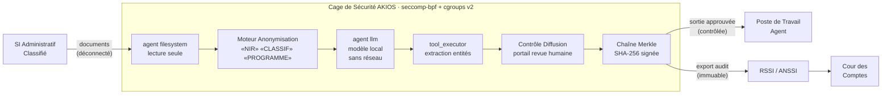

<header class="post-header">
  <div class="post-meta">10 Février 2026 · Ingénierie / Gouvernement · 5 min de lecture</div>
  <h1>IA Souveraine pour le Secteur Public : Déploiements Conformes RGPD et EU AI Act</h1>
</header>

<div class="post-content">

Les administrations publiques sont sous pression pour adopter l'IA — des services aux citoyens à l'analyse de données. Mais les systèmes publics opèrent sous des contraintes que les outils IA commerciaux n'ont pas été conçus pour gérer : **réseaux déconnectés, habilitations, souveraineté des données et exigences de l'EU AI Act.**

On ne peut pas simplement pointer GPT-4 vers des documents administratifs sensibles et espérer le meilleur. Il faut un runtime conçu pour ce modèle de menace dès le départ.

AKIOS fournit exactement cela : une Cage de Sécurité qui tourne entièrement sur site, sans dépendance réseau externe, et produit des pistes d'audit qui satisfont les cadres de conformité européens.

## Le Problème

Les administrations font face à un paradoxe unique : elles détiennent certaines des données les plus sensibles au monde (données citoyennes, renseignement, application de la loi) et certaines des règles les plus strictes sur leur traitement. Les outils IA commerciaux supposent la connectivité cloud, les API tierces et le partage de données — autant de non-starters pour les environnements classifiés.

AKIOS a été conçu pour le **modèle de menace zero-trust et déconnecté** dès le départ.

## Le Cadre Réglementaire

L'IA dans le secteur public européen est encadrée par certains des cadres les plus stricts au monde :

<table>
  <thead>
    <tr><th>Réglementation</th><th>Périmètre</th><th>Comment AKIOS l'Applique</th></tr>
  </thead>
  <tbody>
    <tr>
      <td><strong>RGPD (Art. 6.1.e)</strong></td>
      <td>Les données citoyennes traitées par les administrations sont soumises à des obligations renforcées.</td>
      <td>AKIOS tourne entièrement sur site. Aucune dépendance cloud. Aucune transmission externe.</td>
    </tr>
    <tr>
      <td><strong>EU AI Act (Annexe III)</strong></td>
      <td>Les systèmes IA pour l'accès aux services publics ou l'application de la loi sont classés haut risque.</td>
      <td>AKIOS fournit supervision humaine, traçabilité et évaluations de conformité exigées.</td>
    </tr>
    <tr>
      <td><strong>ANSSI / RGS</strong></td>
      <td>Le Référentiel Général de Sécurité impose des contrôles stricts sur les SI publics.</td>
      <td>Chaîne Merkle fournit preuve continue d'utilisation IA autorisée. Conforme aux exigences RGS.</td>
    </tr>
    <tr>
      <td><strong>SecNumCloud</strong></td>
      <td>Pour les données sensibles, hébergement certifié SecNumCloud requis — exclut les clouds soumis au CLOUD Act.</td>
      <td>Zéro accès réseau au niveau kernel. Souveraineté des données imposée par l'infrastructure.</td>
    </tr>
    <tr>
      <td><strong>Directive NIS2</strong></td>
      <td>Les administrations sont des entités essentielles : notification d'incidents et tests de résilience obligatoires.</td>
      <td>Sandbox déterministe permet des tests de sécurité reproductibles. Transparence totale via la chaîne d'audit.</td>
    </tr>
  </tbody>
</table>

## Le Concept : La Politique en tant que Code

AKIOS introduit le concept de "Security Cage" : un runtime éphémère et sandboxé où les données sont traitées sous des politiques strictes. Pour les déploiements gouvernementaux, la fonctionnalité clé est le **blocage réseau au niveau kernel** : pas des pare-feu applicatifs, mais des filtres seccomp-bpf qui rendent les syscalls réseau physiquement impossibles.

## Le Flux de Travail : Analyse de Documents Administratifs

<table>
  <thead>
    <tr><th>Étape</th><th>Ce qui se passe</th><th>Contrôle de sécurité</th></tr>
  </thead>
  <tbody>
    <tr>
      <td><strong>1. Ingestion</strong></td>
      <td>Documents chargés dans la cage sur un poste déconnecté ou cloud souverain. Aucune connexion réseau.</td>
      <td>Agent filesystem en lecture seule. Les données ne peuvent pas être copiées hors du périmètre.</td>
    </tr>
    <tr>
      <td><strong>2. Anonymisation</strong></td>
      <td>Marqueurs de classification, habilitations et DCP supprimés avant traitement IA</td>
      <td>NIR, codes d'habilitation, noms de programmes remplacés par des jetons.</td>
    </tr>
    <tr>
      <td><strong>3. Analyse IA</strong></td>
      <td>Modèle local traite les documents — synthèse, extraction d'entités, recoupements</td>
      <td>Tous les syscalls réseau bloqués au niveau kernel. Aucune transmission de données possible.</td>
    </tr>
    <tr>
      <td><strong>4. Contrôle de Diffusion</strong></td>
      <td>Les sorties sont vérifiées contre les règles de diffusion avant de quitter la cage</td>
      <td>Tout élément signalé comme potentiellement sensible passe en revue humaine.</td>
    </tr>
    <tr>
      <td><strong>5. Audit</strong></td>
      <td>Chaque opération journalisée dans une piste d'audit en chaîne Merkle</td>
      <td>Preuve infalsifiable pour les contrôles de la Cour des Comptes et inspections ANSSI.</td>
    </tr>
  </tbody>
</table>

### Architecture



### Configuration de la Politique

```yaml
# government-sovereign-policy.yml
security:
  sandbox: strict
  network: blocked  # tous les syscalls réseau bloqués au niveau kernel
  allowed_endpoints: []  # zéro accès réseau
  pii_redaction:
    enabled: true
    patterns: [nir, habilitation, nom_programme, code_service, matricule]
    mode: aggressive
  budget:
    max_cost_per_run: 0.00  # modèle local — zéro coût API
    currency: EUR
  audit:
    merkle_chain: true
    export_format: jsonl
    retention_days: 3650  # 10 ans — conservation archives publiques
  constraints:
    local_model_only: true
    classification_review: mandatory
```

## Ce que l'Agent Voit

À la fin du flux de travail, l'agent administratif reçoit un rapport structuré :

<table>
  <thead>
    <tr><th>Champ</th><th>Valeur</th></tr>
  </thead>
  <tbody>
    <tr><td>Document</td><td>note-2026-0210-****8492.pdf</td></tr>
    <tr><td>Synthèse</td><td>Évaluation régionale — 3 entités identifiées, 2 recoupements avec des rapports existants</td></tr>
    <tr><td>Entités Extraites</td><td>12 organisations, 8 lieux, 4 dates (tous abstraits)</td></tr>
    <tr><td>Signalement Diffusion</td><td>⚠️ La sortie contient des références potentiellement sensibles — envoyé en revue humaine</td></tr>
    <tr><td>Confiance</td><td>86%</td></tr>
    <tr><td>Hash Audit</td><td><code>f1a8d3...c72e</code></td></tr>
    <tr><td>Accès Réseau Tenté</td><td>❌ Aucun — tous les syscalls réseau bloqués au niveau kernel</td></tr>
  </tbody>
</table>

Aucun contenu sensible dans la sortie IA. Aucune exfiltration réseau. Juste une analyse structurée avec une chaîne de preuve infalsifiable.

## Pourquoi C'est Important

- **Souveraineté Totale** : AKIOS bloque tous les syscalls réseau au niveau kernel — pas juste au niveau applicatif. Même un modèle compromis ne peut pas communiquer vers l'extérieur. Compatible SecNumCloud.
- **Aucune Dépendance Cloud** : Le runtime complet tourne localement. Pas d'appels API externes, pas de télémétrie, pas de services tiers soumis au CLOUD Act.
- **Conformité EU AI Act** : Pour les systèmes haut risque du secteur public, AKIOS fournit la supervision humaine, la traçabilité et les évaluations de conformité exigées.
- **Preuve pour la Cour des Comptes** : La piste d'audit en chaîne Merkle fournit une preuve infalsifiable que l'IA a été utilisée dans les limites autorisées.
- **Souveraineté des Données** : La conformité RGPD est imposée par l'infrastructure, pas par des documents de politique. Les données ne peuvent physiquement pas quitter le poste de travail.

## Essayez-le Vous-même

```bash
pip install akios
akios init my-project
akios run templates/batch_processing.yml
```

Sécurisez votre IA. Construisez avec AKIOS.

</div>

<div class="post-footer">
  <p>Connexe : <a href="energy-grid-security.html">IA pour les Infrastructures Critiques</a> | <a href="healthcare-hipaa-security-cage.html">Cage de Sécurité IA pour la Santé</a></p>
  <a href="./">← Retour aux études de cas</a>
</div>
