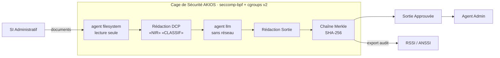

<header class="post-header">
  <div class="post-meta">10 Février 2026 · Ingénierie / Gouvernement · 5 min de lecture</div>
  <h1>IA Souveraine pour le Secteur Public : Déploiements Conformes RGPD et EU AI Act</h1>
  <div class="post-author">
    
    <span>AJ</span>
  </div>
</header>

<div class="post-content">

Les administrations publiques sont sous pression pour adopter l'IA — des services aux citoyens à l'analyse de données. Mais les systèmes publics opèrent sous des contraintes que les outils IA commerciaux n'ont pas été conçus pour gérer : **réseaux déconnectés, habilitations, souveraineté des données et exigences de l'EU AI Act.**

On ne peut pas simplement pointer GPT-4 vers des documents administratifs sensibles et espérer le meilleur. Il faut un runtime conçu pour ce modèle de menace dès le départ.

AKIOS fournit exactement cela : une Cage de Sécurité qui tourne entièrement sur site, sans dépendance réseau externe, et produit des pistes d'audit qui satisfont les cadres de conformité européens.

## Le Cadre Réglementaire

L'IA dans le secteur public européen est encadrée par certains des cadres les plus stricts au monde :

- **RGPD** — Les données des citoyens traitées par les administrations sont soumises à des obligations renforcées. L'intérêt légitime est rarement applicable — le traitement repose sur la mission de service public (Art. 6.1.e).
- **EU AI Act (Art. 6, Annexe III)** — Les systèmes IA utilisés par les administrations publiques pour l'accès aux services publics, l'évaluation de l'éligibilité aux prestations ou l'application de la loi sont classés **haut risque**. Conformité obligatoire.
- **ANSSI — Référentiel Général de Sécurité (RGS)** — Le cadre de sécurité de l'État français impose des contrôles stricts sur les systèmes d'information publics.
- **SecNumCloud** — Pour les données sensibles, l'hébergement doit être certifié SecNumCloud par l'ANSSI — excluant de facto les clouds américains soumis au CLOUD Act.
- **Directive NIS2** — Les administrations publiques sont des entités essentielles : obligations de notification d'incidents, gestion des risques et tests de résilience.

AKIOS applique ces exigences au niveau du runtime — aucune donnée ne quitte le périmètre souverain.

## Le Flux de Travail : Analyse de Documents Administratifs

1. **Ingestion** : Les documents sont chargés dans la Cage de Sécurité sur un poste déconnecté ou un cloud souverain. Aucune connexion réseau externe n'existe — par conception.
2. **La Cage** : AKIOS s'initialise avec la politique gouvernementale : tous les syscalls réseau bloqués au niveau kernel, limites mémoire strictes, et journalisation d'audit alignée RGS/ANSSI.
3. **Analyse** : L'agent IA sandboxé traite les documents — synthèse, extraction d'entités, recoupements — en utilisant un modèle local. Aucune donnée n'est transmise à l'extérieur.
4. **Contrôle de Classification** : Les sorties sont vérifiées contre les règles de diffusion avant de quitter la cage. Tout élément signalé comme potentiellement sensible passe en revue humaine.
5. **Audit** : Chaque opération est journalisée dans une piste d'audit en chaîne Merkle. La chaîne fournit une preuve infalsifiable pour les contrôles de la Cour des Comptes et les inspections ANSSI.

### Architecture



## Pourquoi C'est Important

- **Souveraineté Totale** : AKIOS bloque tous les syscalls réseau au niveau kernel — pas juste au niveau applicatif. Même un modèle compromis ne peut pas communiquer vers l'extérieur. Compatible SecNumCloud.
- **Aucune Dépendance Cloud** : Le runtime complet tourne localement. Pas d'appels API externes, pas de télémétrie, pas de services tiers soumis au CLOUD Act.
- **Conformité EU AI Act** : Pour les systèmes haut risque du secteur public, AKIOS fournit la supervision humaine, la traçabilité et les évaluations de conformité exigées.
- **Preuve pour la Cour des Comptes** : La piste d'audit en chaîne Merkle fournit une preuve infalsifiable que l'IA a été utilisée dans les limites autorisées. Si une entrée de journal est modifiée, la chaîne se brise.

## Essayez-le Vous-même

```bash
pip install akios
akios init my-project
akios run templates/batch_processing.yml
```

Sécurisez votre IA. Construisez avec AKIOS.

</div>

<div class="post-footer">
  <a href="./">← Retour aux études de cas</a>
</div>
