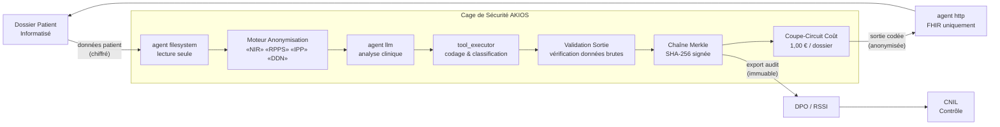

<header class="post-header">
  <div class="post-meta">6 Février 2026 · Ingénierie / Santé · 5 min de lecture</div>
  <h1>Construire une Cage de Sécurité IA Conforme RGPD pour la Santé en 15 Secondes</h1>
</header>

<div class="post-content">

Le principal obstacle à l'adoption de l'IA dans la santé n'est pas la capacité des modèles, mais la **sécurité**. Comment utiliser des LLM puissants comme Grok ou GPT-4 sur des dossiers patients sensibles sans risquer une violation du RGPD ?

La réponse n'est pas d'éviter l'IA, mais de l'enfermer dans une **Cage de Sécurité**.

## Le Problème

Tout DSI hospitalier connaît le dilemme : les modèles IA ont besoin de données pour être utiles, mais les données dont ils ont besoin — numéros de sécurité sociale, identifiants patients, diagnostics, résultats de laboratoire — sont exactement celles que la réglementation impose de protéger. Les approches traditionnelles forcent un choix : **utiliser l'IA et accepter le risque**, ou **rester conforme et rester manuel**.

AKIOS élimine ce compromis.

## Le Cadre Réglementaire

L'IA en santé en Europe doit se conformer à plusieurs cadres qui se superposent :

<table>
  <thead>
    <tr><th>Réglementation</th><th>Périmètre</th><th>Comment AKIOS l'Applique</th></tr>
  </thead>
  <tbody>
    <tr>
      <td><strong>RGPD (Art. 9)</strong></td>
      <td>Les données de santé sont des données sensibles. Traitement interdit sauf exceptions strictes.</td>
      <td>Anonymisation en mémoire à l'ingestion. L'IA ne voit jamais les identifiants patients bruts.</td>
    </tr>
    <tr>
      <td><strong>HDS (Hébergement de Données de Santé)</strong></td>
      <td>En France, les données de santé doivent être hébergées chez un hébergeur certifié HDS.</td>
      <td>Isolation réseau totale. Les données ne quittent jamais l'infrastructure locale. Compatible HDS.</td>
    </tr>
    <tr>
      <td><strong>EU AI Act (Haut Risque)</strong></td>
      <td>Les systèmes IA en santé sont classés haut risque : évaluations de conformité obligatoires.</td>
      <td>Pistes d'audit complètes et contrôles humains satisfont les exigences IA haut risque.</td>
    </tr>
    <tr>
      <td><strong>Loi Bioéthique</strong></td>
      <td>Encadrement du traitement des données génétiques et de santé à des fins de recherche.</td>
      <td>Anonymisation agressive — aucune donnée identifiante ne traverse le moteur IA.</td>
    </tr>
    <tr>
      <td><strong>CNIL — Référentiel Santé</strong></td>
      <td>Recommandations spécifiques de la CNIL pour le traitement IA des données de santé.</td>
      <td>Minimisation des données, limitation des finalités et traçabilité intégrées au runtime.</td>
    </tr>
  </tbody>
</table>

AKIOS applique ces exigences au niveau du runtime — pas comme une checklist, mais comme du code.

## Le Concept : La Politique en tant que Code

AKIOS introduit le concept de "Security Cage" (Cage de Sécurité) : un environnement d'exécution éphémère et cloisonné où les données sont traitées selon des politiques strictes définies par le code. Contrairement à la conformité traditionnelle basée sur la documentation et la confiance, la Cage de Sécurité rend les violations **physiquement impossibles** au niveau infrastructure.

## Le Flux de Travail : Anonymisation Automatisée des DCP

<table>
  <thead>
    <tr><th>Étape</th><th>Ce qui se passe</th><th>Contrôle de sécurité</th></tr>
  </thead>
  <tbody>
    <tr>
      <td><strong>1. Ingestion</strong></td>
      <td>Dossier patient brut (NIR, Nom, Adresse, IPP) chargé dans la cage</td>
      <td>Données entrées via agent filesystem en lecture seule. Aucune copie hors de la cage.</td>
    </tr>
    <tr>
      <td><strong>2. Anonymisation</strong></td>
      <td>50+ motifs de DCP détectés et masqués avant traitement IA</td>
      <td>NIR, IPP, RPPS, date de naissance remplacés par des jetons. L'original n'atteint jamais le LLM.</td>
    </tr>
    <tr>
      <td><strong>3. Analyse IA</strong></td>
      <td>Le LLM effectue l'analyse clinique sur le contenu anonymisé — codage, synthèse, alertes</td>
      <td>Budget plafonné (1,00 €/dossier), isolation réseau, aucun stockage persistant.</td>
    </tr>
    <tr>
      <td><strong>4. Intégration</strong></td>
      <td>Résultat anonymisé déployé vers l'API DPI autorisée (Hprim/FHIR)</td>
      <td>Agent HTTP verrouillé sur les endpoints FHIR approuvés uniquement.</td>
    </tr>
    <tr>
      <td><strong>5. Audit</strong></td>
      <td>Chaque octet lu, écrit et transmis journalisé avec empreinte cryptographique</td>
      <td>Chaîne Merkle — si une entrée est altérée, toute la chaîne est invalidée.</td>
    </tr>
  </tbody>
</table>

### Architecture



### Configuration de la Politique

L'ensemble de la posture de conformité est défini dans un seul fichier YAML :

```yaml
# healthcare-rgpd-policy.yml
security:
  sandbox: strict
  network: isolated
  allowed_endpoints:
    - dpi-fhir.interne:443
  pii_redaction:
    enabled: true
    patterns: [nir, ipp, rpps, date_naissance, telephone, adresse, numero_assure]
    mode: aggressive
  budget:
    max_cost_per_run: 1.00
    currency: EUR
  audit:
    merkle_chain: true
    export_format: jsonl
    retention_days: 7300  # 20 ans — conservation dossier médical
```

## Ce que le DPO Voit

À la fin du flux de travail, l'équipe conformité reçoit un rapport structuré :

<table>
  <thead>
    <tr><th>Champ</th><th>Valeur</th></tr>
  </thead>
  <tbody>
    <tr><td>Dossier</td><td>admission-2026-0206-****4281.pdf</td></tr>
    <tr><td>Code Clinique</td><td>CIM-10 : E11.9 — Diabète de type 2 sans complication</td></tr>
    <tr><td>Alertes</td><td>Interaction médicamenteuse — metformine + produit de contraste iodé programmé</td></tr>
    <tr><td>Confiance</td><td>94%</td></tr>
    <tr><td>Hash Audit</td><td><code>b4a7c1...d82f</code></td></tr>
    <tr><td>DCP Exposées</td><td>❌ Aucune — tous les identifiants anonymisés avant analyse</td></tr>
    <tr><td>Soumission FHIR</td><td>✅ Sortie codée soumise au endpoint DPI FHIR</td></tr>
  </tbody>
</table>

Pas de NIR. Pas de noms de patients. Pas de dossiers médicaux bruts. Juste des sorties cliniques actionnables avec une chaîne de preuve cryptographique.

## Pourquoi C'est Important

- **Zéro Exposition de DCP** : Les identifiants patients sont anonymisés avant tout traitement IA. Même un modèle compromis ne peut rien fuiter.
- **Décisions Auditables** : Chaque code clinique et alerte inclut une chaîne de preuve cryptographique. La CNIL peut tracer exactement comment une décision a été prise.
- **Maîtrise des Coûts** : Des limites de budget strictes par dossier empêchent les factures API incontrôlées — essentiel lors du traitement de milliers d'admissions.
- **Conservation 20 Ans** : Les logs de la chaîne Merkle sont exportables en format JSONL, conformément à l'exigence de conservation du dossier médical.
- **Conforme EU AI Act** : Pistes d'audit complètes et contrôles humains satisfont les exigences de classification IA haut risque.

## Essayez-le Vous-même

AKIOS est open-source. Vous pouvez exécuter ce flux de travail dès aujourd'hui :

```bash
pip install akios
akios init my-project
akios run templates/file_analysis.yml
```

Sécurisez votre IA. Construisez avec AKIOS.

</div>

<div class="post-footer">
  <p>Connexe : <a href="banking-security-cage.html">Cage de Sécurité IA Conforme DSP2 pour la Banque</a> | <a href="pharma-clinical-trials.html">IA sous Contrôles ANSM pour la Pharma</a></p>
  <a href="./">← Retour aux études de cas</a>
</div>
