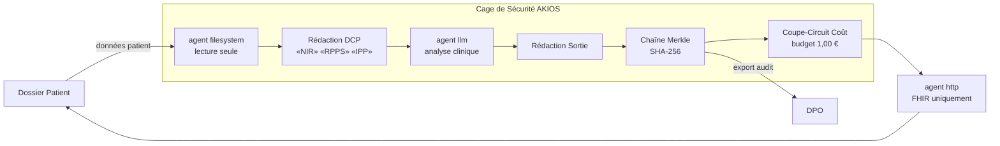

<header class="post-header">
  <div class="post-meta">6 Février 2026 · Ingénierie / Santé · 5 min de lecture</div>
  <h1>Construire une Cage de Sécurité IA Conforme RGPD en 15 Secondes</h1>
  <div class="post-author">
    
    <span>AJ</span>
  </div>
</header>

<div class="post-content">

Le principal obstacle à l'adoption de l'IA dans la santé n'est pas la capacité des modèles, mais la **sécurité**. Comment utiliser des LLM puissants comme Grok ou GPT-4 sur des dossiers patients sensibles sans risquer une violation du RGPD ?

La réponse n'est pas d'éviter l'IA, mais de l'enfermer dans une **Cage de Sécurité**.

## Le Cadre Réglementaire

L'IA en santé en Europe doit se conformer à plusieurs cadres qui se superposent :

- **RGPD (Art. 9)** — Les données de santé sont des données sensibles. Traitement interdit sauf exceptions strictes (consentement explicite, intérêt vital, etc.).
- **EU AI Act (Haut Risque)** — Les systèmes IA utilisés en santé sont classés haut risque : évaluations de conformité, supervision humaine et pistes d'audit complètes obligatoires.
- **Loi Bioéthique & HDS** — En France, les données de santé doivent être hébergées chez un Hébergeur de Données de Santé certifié.

AKIOS applique ces exigences au niveau du runtime — pas comme une checklist, mais comme du code.

## Le Concept : La Politique en tant que Code

AKIOS introduit le concept de "Security Cage" (Cage de Sécurité) : un environnement d'exécution éphémère et cloisonné où les données sont traitées selon des politiques strictes définies par le code.

Dans notre dernière démonstration, nous présentons un flux de travail courant : **L'Anonymisation Automatisée des DCP**.

### Le Flux de Travail

1. **Ingestion** : Un dossier d'admission patient brut (contenant Nom, Sécu, Adresse) est chargé dans l'espace de travail sécurisé.
2. **La Cage** : Le runtime AKIOS s'initialise. Il bloque tous les appels réseau non autorisés, impose un budget strict (ex: limite de 1,00 €) et charge la politique d'anonymisation RGPD.
3. **Exécution** : Un agent IA reçoit un accès temporaire au texte *uniquement* pour identifier et supprimer les données personnelles. Il ne peut pas sauvegarder les données brutes ailleurs.
4. **Intégration** : Le résultat anonymisé et vérifié est déployé de manière sécurisée vers une API DPI autorisée (Hprim/FHIR).
5. **Audit** : Chaque octet lu, écrit et transmis est journalisé avec une empreinte cryptographique. Si la trace d'audit est rompue, le flux de travail échoue.

### Architecture



## Pourquoi C'est Important

La conformité traditionnelle implique des revues manuelles et une architecture basée sur la confiance. AKIOS change cela pour une architecture basée sur la **vérification**.

- **Déterministe** : La même entrée produit toujours le même résultat audité.
- **Local-First** : Exécutez ceci sur votre poste ou sur un serveur déconnecté. Les DCP ne quittent jamais votre infrastructure.
- **Maîtrise des Coûts** : Des coupe-circuits empêchent les factures API incontrôlées.
- **Conforme EU AI Act** : Pistes d'audit complètes et contrôles humains satisfont les exigences IA haut risque.

## Essayez-le Vous-même

AKIOS est open-source. Vous pouvez exécuter ce flux de travail dès aujourd'hui :

```bash
pip install akios
akios init my-project
akios run templates/file_analysis.yml
```

Sécurisez votre IA. Construisez avec AKIOS.

</div>

<div class="post-footer">
  <a href="./">← Retour aux études de cas</a>
</div>
