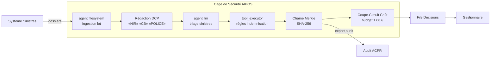

<header class="post-header">
  <div class="post-meta">10 Février 2026 · Ingénierie / Assurance · 5 min de lecture</div>
  <h1>IA Sécurisée pour l'Assurance : Traitement de Sinistres sans Exposition de Données</h1>
  <div class="post-author">
    
    <span>AJ</span>
  </div>
</header>

<div class="post-content">

Les compagnies d'assurance traitent des milliers de sinistres par jour — dommages matériels, frais médicaux, litiges de responsabilité. L'IA peut accélérer l'instruction, détecter la fraude et réduire les délais de traitement. Le défi : **les données des assurés incluent des dossiers médicaux, des détails financiers et des informations personnelles qui ne doivent jamais fuiter.**

AKIOS résout cela avec la Cage de Sécurité : un runtime éphémère et sandboxé où l'IA traite les sinistres sous des politiques strictes définies par le code.

## Le Cadre Réglementaire

Les compagnies d'assurance en Europe opèrent sous des cadres réglementaires exigeants :

- **RGPD** — Les données des assurés sont des données personnelles. Tout traitement IA doit respecter la minimisation, la limitation des finalités et les droits des personnes concernées (Art. 22 sur les décisions automatisées).
- **EU AI Act** — Les systèmes IA d'évaluation de sinistres et de scoring sont classés haut risque : supervision humaine obligatoire, transparence et évaluation de conformité.
- **Solvabilité II / DORA** — Les assureurs doivent garantir la résilience opérationnelle numérique, y compris pour les systèmes IA tiers utilisés dans le traitement des sinistres.
- **ACPR** — Le régulateur français exige une traçabilité complète des décisions automatisées affectant les assurés, incluant les traitements IA.

AKIOS applique ces exigences au niveau du runtime — l'agent IA n'opère jamais en dehors du périmètre de conformité.

## Le Flux de Travail : Instruction Automatisée des Sinistres

1. **Ingestion** : Un lot de nouveaux sinistres est chargé dans la Cage de Sécurité. Les numéros de sécurité sociale, numéros de contrat et identifiants médicaux sont anonymisés avant que l'IA ne les voie.
2. **La Cage** : AKIOS s'initialise avec la politique assurance : isolation réseau, budget plafonné à 0,30 € par sinistre, et journalisation d'audit conforme DORA.
3. **Analyse** : L'agent IA sandboxé évalue les sinistres par rapport aux conditions du contrat — évaluation des dommages, vérification de couverture, revue de nécessité médicale — en utilisant uniquement des données anonymisées.
4. **Classification** : Les sinistres sont classés en approuvé, refusé ou escaladé avec des scores de confiance et des références réglementaires. L'IA ne peut pas autoriser de paiements.
5. **Audit** : Chaque inférence, accès aux données et sortie est signé cryptographiquement dans une chaîne Merkle. Les régulateurs peuvent vérifier le chemin de décision complet.

### Architecture



## Pourquoi C'est Important

- **Zéro Exposition de Données** : Les numéros de sécurité sociale, dossiers médicaux et détails de contrat sont anonymisés avant tout traitement IA.
- **Conformité Art. 22 RGPD** : Les décisions automatisées affectant les assurés incluent toujours une supervision humaine et un droit à l'explication.
- **Détection de Fraude** : La sandbox peut croiser les schémas de sinistres sans exposer les données individuelles des assurés.
- **Décisions Auditables** : Chaque classification inclut une chaîne de preuve cryptographique. L'ACPR peut tracer exactement comment une décision a été prise.

## Essayez-le Vous-même

```bash
pip install akios
akios init my-project
akios run templates/batch_processing.yml
```

Sécurisez votre IA. Construisez avec AKIOS.

</div>

<div class="post-footer">
  <a href="./">← Retour aux études de cas</a>
</div>
