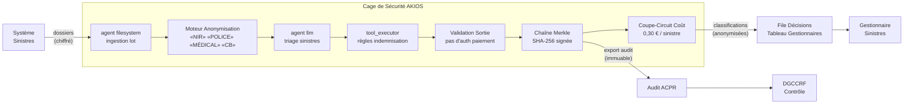

<header class="post-header">
  <div class="post-meta">10 Février 2026 · Ingénierie / Assurance · 5 min de lecture</div>
  <h1>IA Sécurisée pour l'Assurance : Traitement de Sinistres sans Exposition de Données</h1>
</header>

<div class="post-content">

Les compagnies d'assurance traitent des milliers de sinistres par jour — dommages matériels, frais médicaux, litiges de responsabilité. L'IA peut accélérer l'instruction, détecter la fraude et réduire les délais de traitement. Le défi : **les données des assurés incluent des dossiers médicaux, des détails financiers et des informations personnelles qui ne doivent jamais fuiter.**

AKIOS résout cela avec la Cage de Sécurité : un runtime éphémère et sandboxé où l'IA traite les sinistres sous des politiques strictes définies par le code.

## Le Problème

L'instruction des sinistres est un goulot d'étranglement. L'adjudication manuelle est lente, incohérente et coûteuse. L'IA peut évaluer un sinistre en quelques secondes — mais connecter un modèle aux données des assurés crée un nouveau vecteur de risque. Dossiers médicaux, NIR, numéros de contrat et détails financiers sont tous en jeu. Une fuite ne signifie pas juste des amendes — elle signifie des recours collectifs et une perte de confiance.

AKIOS permet de déployer l'IA sur les données de sinistres **sans exposer aucun identifiant d'assuré**.

## Le Cadre Réglementaire

Les compagnies d'assurance en Europe opèrent sous des cadres réglementaires exigeants :

<table>
  <thead>
    <tr><th>Réglementation</th><th>Périmètre</th><th>Comment AKIOS l'Applique</th></tr>
  </thead>
  <tbody>
    <tr>
      <td><strong>RGPD (Art. 22)</strong></td>
      <td>Les décisions automatisées affectant les assurés requièrent supervision humaine et droit à l'explication.</td>
      <td>Modèles de politique par type de sinistre assurent le respect des règles spécifiques.</td>
    </tr>
    <tr>
      <td><strong>Solvabilité II</strong></td>
      <td>Les assureurs doivent documenter et auditer tous les processus automatisés de gestion des risques.</td>
      <td>Identifiants médicaux anonymisés avant traitement IA. Zéro exposition de données de santé.</td>
    </tr>
    <tr>
      <td><strong>DORA</strong></td>
      <td>Résilience opérationnelle numérique — les systèmes IA tiers doivent garantir la continuité de service.</td>
      <td>Chaîne d'audit Merkle — chaque classification signée cryptographiquement et immuable.</td>
    </tr>
    <tr>
      <td><strong>ACPR</strong></td>
      <td>Le régulateur français exige une traçabilité complète des décisions automatisées affectant les assurés.</td>
      <td>Provenance complète de la décision exportée par sinistre. Explications d'action défavorable incluses.</td>
    </tr>
    <tr>
      <td><strong>Code des Assurances</strong></td>
      <td>Obligations de traitement équitable, délais d'instruction et information des assurés.</td>
      <td>Toutes les DCP anonymisées avant traitement IA. La piste d'audit prouve qu'aucune donnée retenue par le modèle.</td>
    </tr>
  </tbody>
</table>

AKIOS applique ces exigences au niveau du runtime — l'agent IA n'opère jamais en dehors du périmètre de conformité.

## Le Concept : La Politique en tant que Code

AKIOS introduit le concept de "Security Cage" : un runtime éphémère et sandboxé où les données sont traitées sous des politiques strictes. Pour l'assurance, la fonctionnalité clé est la **configuration par type de sinistre** : les règles de conformité peuvent être adaptées selon la branche (auto, habitation, santé, RC), assurant le respect des exigences spécifiques.

## Le Flux de Travail : Instruction Automatisée des Sinistres

<table>
  <thead>
    <tr><th>Étape</th><th>Ce qui se passe</th><th>Contrôle de sécurité</th></tr>
  </thead>
  <tbody>
    <tr>
      <td><strong>1. Ingestion</strong></td>
      <td>Lot de nouveaux sinistres chargé dans la Cage de Sécurité</td>
      <td>NIR, numéros de contrat et identifiants médicaux anonymisés avant que l'IA ne les voie.</td>
    </tr>
    <tr>
      <td><strong>2. Anonymisation</strong></td>
      <td>Identifiants d'assurés supprimés et remplacés par des jetons</td>
      <td>50+ motifs de DCP incluant codes médicaux, comptes financiers, adresses remplacés.</td>
    </tr>
    <tr>
      <td><strong>3. Analyse IA</strong></td>
      <td>Le LLM évalue les sinistres — évaluation des dommages, vérification de couverture, nécessité médicale</td>
      <td>Budget plafonné (0,30 €/sinistre), isolation réseau, aucun stockage persistant.</td>
    </tr>
    <tr>
      <td><strong>4. Classification</strong></td>
      <td>Sinistres classés en approuvé, refusé ou escaladé avec scores de confiance</td>
      <td>L'IA ne peut pas autoriser de paiements. Toute approbation nécessite confirmation humaine.</td>
    </tr>
    <tr>
      <td><strong>5. Audit</strong></td>
      <td>Chaque inférence, accès aux données et sortie signé cryptographiquement</td>
      <td>L'ACPR peut vérifier le chemin de décision complet pour tout sinistre.</td>
    </tr>
  </tbody>
</table>

### Architecture



### Configuration de la Politique

```yaml
# assurance-sinistres-policy.yml
security:
  sandbox: strict
  network: isolated
  allowed_endpoints: []  # zéro accès réseau
  pii_redaction:
    enabled: true
    patterns: [nir, numero_police, dossier_medical, carte_bancaire, adresse, date_naissance]
    mode: aggressive
  budget:
    max_cost_per_run: 0.30
    currency: EUR
  audit:
    merkle_chain: true
    export_format: jsonl
    retention_days: 3650  # 10 ans — conservation Code des Assurances
  constraints:
    payment_authorization: disabled  # l'IA ne peut pas autoriser de paiements
    human_review: required_for_denials
```

## Ce que le Gestionnaire Voit

À la fin du flux de travail, le gestionnaire de sinistres reçoit un rapport structuré :

<table>
  <thead>
    <tr><th>Champ</th><th>Valeur</th></tr>
  </thead>
  <tbody>
    <tr><td>ID Sinistre</td><td>SIN-2026-0210-****5847</td></tr>
    <tr><td>Classification</td><td>⚠️ Escalade — Ambiguïté de couverture détectée</td></tr>
    <tr><td>Analyse</td><td>Sinistre dégât des eaux cite « soudain et accidentel » mais la description indique une infiltration progressive sur 3 mois</td></tr>
    <tr><td>Référence Contrat</td><td>Article 4.2.1 — Exclusion pour détérioration progressive</td></tr>
    <tr><td>Indicateurs Fraude</td><td>Aucun détecté (score risque 0,12)</td></tr>
    <tr><td>Confiance</td><td>89%</td></tr>
    <tr><td>Hash Audit</td><td><code>d8f2a1...c47b</code></td></tr>
    <tr><td>Données Assuré Exposées</td><td>❌ Aucune — toutes les DCP anonymisées avant analyse</td></tr>
  </tbody>
</table>

Pas de NIR. Pas de numéros de contrat. Pas de détails médicaux. Juste du renseignement d'instruction avec une chaîne de preuve cryptographique.

## Pourquoi C'est Important

- **Zéro Exposition de Données** : NIR, dossiers médicaux et détails de contrat anonymisés avant tout traitement IA. Même un modèle compromis ne peut rien fuiter.
- **Conformité Art. 22 RGPD** : Les décisions automatisées affectant les assurés incluent toujours supervision humaine et droit à l'explication.
- **Détection de Fraude** : La sandbox peut croiser les schémas de sinistres sans exposer les données individuelles des assurés.
- **Décisions Auditables** : Chaque classification inclut une chaîne de preuve cryptographique. L'ACPR peut tracer exactement comment une décision a été prise.
- **Pas de Paiements Non Autorisés** : Des contraintes codées en dur empêchent l'IA d'autoriser tout paiement. Toutes les actions financières nécessitent confirmation humaine.

## Essayez-le Vous-même

```bash
pip install akios
akios init my-project
akios run templates/batch_processing.yml
```

Sécurisez votre IA. Construisez avec AKIOS.

</div>

<div class="post-footer">
  <p>Connexe : <a href="healthcare-hipaa-security-cage.html">Cage de Sécurité IA pour la Santé</a> | <a href="banking-fraud-detection.html">Détection de Fraude pour la Banque</a></p>
  <a href="./">← Retour aux études de cas</a>
</div>
