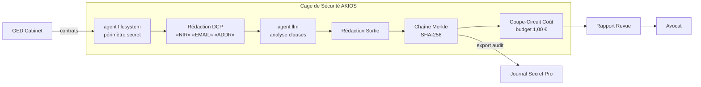

<header class="post-header">
  <div class="post-meta">9 Février 2026 · Ingénierie / Juridique · 5 min de lecture</div>
  <h1>Revue de Contrats par IA sous Secret Professionnel et RGPD</h1>
  <div class="post-author">
    
    <span>AJ</span>
  </div>
</header>

<div class="post-content">

Les cabinets d'avocats traitent des montagnes de documents : contrats, mémoires, pièces de procédure. L'IA peut les analyser des ordres de grandeur plus vite qu'un juriste. Mais les documents juridiques portent une obligation qu'aucune autre industrie ne connaît : **le secret professionnel.**

Si un système IA divulgue des communications confidentielles ou envoie des données client à une API tierce, le secret peut être levé — définitivement. Ce n'est pas une amende. Cela peut faire perdre des affaires.

AKIOS résout cela avec une Cage de Sécurité où l'IA traite les documents juridiques sans jamais exposer le contenu confidentiel en dehors du périmètre.

## Le Cadre Réglementaire

L'IA juridique en Europe doit naviguer entre :

- **RGPD (Art. 6, 9, 22)** — Les données personnelles dans les documents juridiques sont protégées. Le profilage automatisé est soumis au droit à l'explication et à l'intervention humaine.
- **EU AI Act** — Les systèmes IA utilisés dans l'administration de la justice ou l'assistance juridique sont classés haut risque : évaluation de conformité, supervision humaine et audit requis.
- **Secret Professionnel (Art. 226-13 Code Pénal)** — L'avocat a l'obligation absolue de protéger les informations confidentielles de ses clients, y compris face aux outils IA.
- **Règlement Intérieur National (RIN)** — Le Conseil National des Barreaux impose des obligations spécifiques sur l'utilisation d'outils numériques par les avocats.
- **CNIL — Recommandations IA** — La CNIL a publié des recommandations spécifiques sur l'utilisation de l'IA dans le traitement de données personnelles.

AKIOS applique ces exigences au niveau du runtime — le secret ne quitte jamais la cage.

## Le Flux de Travail : Revue de Documents Confidentiels

1. **Ingestion** : Un ensemble de contrats ou de pièces de procédure est chargé dans la Cage de Sécurité. Les noms, numéros de compte et identifiants clients sont anonymisés en mémoire.
2. **La Cage** : AKIOS s'initialise avec la politique juridique : isolation réseau totale (aucune donnée ne quitte la machine), budget plafonné à 0,50 € par lot de documents, et journalisation respectant le secret professionnel.
3. **Revue** : L'agent IA sandboxé classifie les documents par pertinence, identifie les clauses clés (indemnisation, plafonds de responsabilité, changement de contrôle) et signale les problèmes potentiels — le tout sur du contenu anonymisé.
4. **Contrôle Secret** : Avant qu'une sortie ne quitte la cage, AKIOS vérifie qu'aucun contenu confidentiel n'est inclus dans les résultats. Les éléments signalés vont en revue humaine.
5. **Audit** : Chaque accès document, classification et sortie est journalisé avec des signatures cryptographiques. La chaîne complète prouve que la revue a été menée dans les limites du secret professionnel.

### Architecture



## Pourquoi C'est Important

- **Secret Préservé** : L'isolation réseau totale signifie que les documents confidentiels ne quittent jamais la machine locale. Aucune donnée n'est envoyée à des API externes — jamais.
- **Conformité EU AI Act** : Le journal d'audit immuable prouve la supervision humaine de l'outil IA, satisfaisant les exigences haut risque.
- **eDiscovery Défendable** : Chaque étape du processus de revue est signée cryptographiquement. En cas de contestation, le cabinet peut prouver exactement comment les documents ont été traités.
- **Maîtrise des Coûts pour les Clients** : Les limites budgétaires strictes rendent la revue assistée par IA prévisible en coûts — un argument majeur pour des clients fatigués des surprises d'honoraires.

## Essayez-le Vous-même

```bash
pip install akios
akios init my-project
akios run templates/file_analysis.yml
```

Sécurisez votre IA. Construisez avec AKIOS.

</div>

<div class="post-footer">
  <a href="./">← Retour aux études de cas</a>
</div>
