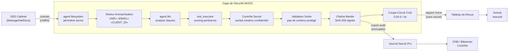

<header class="post-header">
  <div class="post-meta">9 Février 2026 · Ingénierie / Juridique · 5 min de lecture</div>
  <h1>Revue de Contrats par IA sous Secret Professionnel et RGPD</h1>
</header>

<div class="post-content">

Les cabinets d'avocats traitent des montagnes de documents : contrats, mémoires, pièces de procédure. L'IA peut les analyser des ordres de grandeur plus vite qu'un juriste. Mais les documents juridiques portent une obligation qu'aucune autre industrie ne connaît : **le secret professionnel.**

Si un système IA divulgue des communications confidentielles ou envoie des données client à une API tierce, le secret peut être levé — définitivement. Ce n'est pas une amende. Cela peut faire perdre des affaires.

AKIOS résout cela avec une Cage de Sécurité où l'IA traite les documents juridiques sans jamais exposer le contenu confidentiel en dehors du périmètre.

## Le Problème

La revue documentaire est l'une des activités les plus coûteuses du contentieux. Une seule affaire peut impliquer des milliers de documents. L'IA peut classifier, synthétiser et signaler les documents pertinents en heures au lieu de semaines — mais dès que vous connectez un modèle IA à des communications protégées par le secret, vous créez un risque de levée du secret. Un seul appel API vers un service externe avec du contenu protégé, et la partie adverse plaidera la violation du secret.

AKIOS garantit que **le contenu confidentiel ne quitte jamais la machine locale**.

## Le Cadre Réglementaire

L'IA juridique en Europe doit naviguer entre des obligations professionnelles uniques :

<table>
  <thead>
    <tr><th>Réglementation</th><th>Périmètre</th><th>Comment AKIOS l'Applique</th></tr>
  </thead>
  <tbody>
    <tr>
      <td><strong>Secret Professionnel (Art. 226-13 CP)</strong></td>
      <td>L'avocat a l'obligation absolue de protéger les informations confidentielles de ses clients, y compris face aux outils IA.</td>
      <td>Journal d'audit immuable prouve la supervision humaine de l'outil IA.</td>
    </tr>
    <tr>
      <td><strong>RGPD (Art. 6, 9, 22)</strong></td>
      <td>Données personnelles dans les documents juridiques protégées. Profilage automatisé soumis au droit à l'explication.</td>
      <td>Chaque étape de classification signée cryptographiquement. Chaîne de custody défendable.</td>
    </tr>
    <tr>
      <td><strong>RIN (Règlement Intérieur National)</strong></td>
      <td>Le CNB impose des obligations spécifiques sur l'utilisation d'outils numériques par les avocats.</td>
      <td>Toutes les DCP anonymisées avant traitement IA. Aucune donnée personnelle retenue par le modèle.</td>
    </tr>
    <tr>
      <td><strong>EU AI Act (Haut Risque)</strong></td>
      <td>Les systèmes IA dans l'administration de la justice ou l'assistance juridique sont classés haut risque.</td>
      <td>Chaîne d'audit Merkle satisfait les exigences de preuve pour la revue assistée par IA.</td>
    </tr>
    <tr>
      <td><strong>CNIL — Recommandations IA</strong></td>
      <td>Recommandations spécifiques sur l'utilisation de l'IA dans le traitement de données personnelles.</td>
      <td>Transparence totale : la piste d'audit montre exactement ce que l'IA a analysé et produit.</td>
    </tr>
  </tbody>
</table>

AKIOS applique ces exigences au niveau du runtime — le secret ne quitte jamais la cage.

## Le Concept : La Politique en tant que Code

AKIOS introduit le concept de "Security Cage" : un runtime éphémère et sandboxé où les données sont traitées sous des politiques strictes. Pour le juridique, l'innovation clé est l'**isolation réseau totale** : aucune donnée ne quitte la machine locale, rendant la levée du secret par appel API externe physiquement impossible.

## Le Flux de Travail : Revue de Documents Confidentiels

<table>
  <thead>
    <tr><th>Étape</th><th>Ce qui se passe</th><th>Contrôle de sécurité</th></tr>
  </thead>
  <tbody>
    <tr>
      <td><strong>1. Ingestion</strong></td>
      <td>Contrats ou pièces de procédure chargés dans la cage</td>
      <td>Noms, numéros de compte et identifiants clients anonymisés en mémoire.</td>
    </tr>
    <tr>
      <td><strong>2. Anonymisation</strong></td>
      <td>DCP clients et marqueurs potentiellement confidentiels supprimés avant traitement IA</td>
      <td>NIR, email, adresse, codes client remplacés par des jetons. Les originaux n'atteignent jamais le LLM.</td>
    </tr>
    <tr>
      <td><strong>3. Revue IA</strong></td>
      <td>Le LLM classifie les documents, identifie les clauses clés, signale les problèmes — tout sur contenu anonymisé</td>
      <td>Isolation réseau totale. Budget plafonné (0,50 €/lot). Aucun stockage persistant.</td>
    </tr>
    <tr>
      <td><strong>4. Contrôle Secret</strong></td>
      <td>Avant qu'une sortie ne quitte la cage, AKIOS vérifie qu'aucun contenu confidentiel n'est inclus</td>
      <td>Les éléments signalés vont en revue humaine. L'IA ne peut pas lever le secret.</td>
    </tr>
    <tr>
      <td><strong>5. Audit</strong></td>
      <td>Chaque accès document, classification et sortie journalisé avec signatures cryptographiques</td>
      <td>La chaîne prouve que la revue a été menée dans les limites du secret professionnel.</td>
    </tr>
  </tbody>
</table>

### Architecture



### Configuration de la Politique

```yaml
# juridique-secret-policy.yml
security:
  sandbox: strict
  network: blocked  # isolation réseau absolue — aucun appel API
  allowed_endpoints: []
  pii_redaction:
    enabled: true
    patterns: [nir, email, adresse, telephone, code_client, numero_dossier]
    mode: aggressive
  budget:
    max_cost_per_run: 0.50
    currency: EUR
  audit:
    merkle_chain: true
    export_format: jsonl
    retention_days: 3650  # 10 ans — support mise en état
  constraints:
    privilege_check: mandatory
    network_access: blocked_at_kernel
```

## Ce que l'Avocat Voit

À la fin du flux de travail, l'avocat associé reçoit un rapport structuré :

<table>
  <thead>
    <tr><th>Champ</th><th>Valeur</th></tr>
  </thead>
  <tbody>
    <tr><td>Lot Documents</td><td>dossier-2026-0209-****7163 (142 documents)</td></tr>
    <tr><td>Pertinents</td><td>23 documents signalés comme très pertinents pour l'action en inexécution contractuelle</td></tr>
    <tr><td>Clause Clé</td><td>Plafond d'indemnisation de 5 M€ identifié en Section 8.2 — incohérent avec le plafond de 10 M€ dans l'Avenant 3</td></tr>
    <tr><td>Alerte Risque</td><td>🔴 Clause de changement de contrôle activée — délai de notification de 30 jours (expire le 12 mars)</td></tr>
    <tr><td>Signalement Secret</td><td>⚠️ 3 documents contiennent du contenu potentiellement protégé — envoyés en revue avocat</td></tr>
    <tr><td>Confiance</td><td>92%</td></tr>
    <tr><td>Hash Audit</td><td><code>b7e4c2...d91a</code></td></tr>
    <tr><td>Accès Réseau Tenté</td><td>❌ Aucun — tous les syscalls réseau bloqués au niveau kernel</td></tr>
  </tbody>
</table>

Pas de noms de clients. Pas de détails de dossier. Pas de contenu protégé dans la sortie. Juste du renseignement contractuel avec une chaîne de preuve défendable.

## Pourquoi C'est Important

- **Secret Préservé** : L'isolation réseau totale signifie que les documents confidentiels ne quittent jamais la machine locale. Aucune donnée n'est envoyée à des API externes — jamais.
- **Conformité EU AI Act** : Le journal d'audit immuable prouve la supervision humaine de l'outil IA, satisfaisant les exigences haut risque.
- **Procédure Défendable** : Chaque étape du processus de revue est signée cryptographiquement. En cas de contestation, le cabinet peut prouver exactement comment les documents ont été traités.
- **Maîtrise des Coûts pour les Clients** : Les limites budgétaires strictes rendent la revue assistée par IA prévisible en coûts — un argument majeur pour les clients.
- **Prêt pour le CNB** : La piste d'audit complète montre exactement ce que l'IA a analysé et produit, satisfaisant les exigences de transparence déontologique.

## Essayez-le Vous-même

```bash
pip install akios
akios init my-project
akios run templates/file_analysis.yml
```

Sécurisez votre IA. Construisez avec AKIOS.

</div>

<div class="post-footer">
  <p>Connexe : <a href="government-airgap-deployment.html">IA Souveraine pour le Secteur Public</a> | <a href="accounting-document-processing.html">IA Contrôlée pour la Comptabilité</a></p>
  <a href="./">← Retour aux études de cas</a>
</div>
