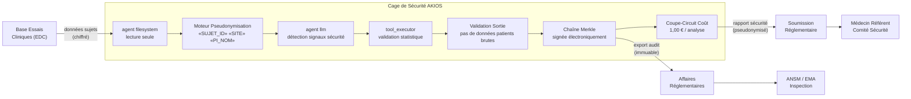

<header class="post-header">
  <div class="post-meta">10 Février 2026 · Ingénierie / Pharmaceutique · 5 min de lecture</div>
  <h1>IA Sandboxée pour la Pharma : Accélérer les Essais Cliniques sous Contrôles Réglementaires</h1>
</header>

<div class="post-content">

Les entreprises pharmaceutiques dépensent en moyenne 2,6 milliards d'euros et 10 à 15 ans pour mettre un seul médicament sur le marché. L'IA peut compresser ce délai — en analysant les données d'essais, en identifiant les événements indésirables et en optimisant les cohortes. Le problème : **les données d'essais cliniques contiennent les informations de santé les plus sensibles qui soient, et les régulateurs exigent une reproductibilité complète.**

AKIOS résout cela avec la Cage de Sécurité : un runtime éphémère et sandboxé où l'IA traite les données d'essais sous des politiques strictes définies par le code.

## Le Problème

Les essais cliniques génèrent des jeux de données énormes : rapports d'événements indésirables, résultats de laboratoire, critères d'évaluation. Les réviseurs humains mettent des semaines à identifier des signaux de sécurité que l'IA peut repérer en minutes. Mais connecter l'IA aux données d'essais crée une tension fondamentale : les régulateurs exigent une reproductibilité et une auditabilité complètes, tandis que les règles de protection des données imposent que les identifiants patients ne soient jamais exposés.

AKIOS vous offre la détection de signaux assistée par IA **avec une auditabilité de grade réglementaire et zéro exposition de données patients**.

## Le Cadre Réglementaire

L'industrie pharmaceutique en Europe est soumise à un cadre réglementaire étroitement imbriqué :

<table>
  <thead>
    <tr><th>Réglementation</th><th>Périmètre</th><th>Comment AKIOS l'Applique</th></tr>
  </thead>
  <tbody>
    <tr>
      <td><strong>RGPD (Art. 9)</strong></td>
      <td>Les données de santé des participants sont des données sensibles. Bases légales renforcées et minimisation des données.</td>
      <td>Chaîne d'audit Merkle avec signatures cryptographiques satisfait les exigences de traçabilité.</td>
    </tr>
    <tr>
      <td><strong>Loi Jardé / Règlement EU 536/2014</strong></td>
      <td>La recherche impliquant la personne humaine exige confidentialité des participants et intégrité des données.</td>
      <td>Identifiants patients supprimés avant traitement IA. Cage éphémère détruite après chaque exécution.</td>
    </tr>
    <tr>
      <td><strong>EU AI Act (Haut Risque)</strong></td>
      <td>Les systèmes IA en recherche clinique et pharmacovigilance sont classés haut risque.</td>
      <td>Sandbox déterministe assure une analyse reproductible. Supervision humaine pour tous les signaux de sécurité.</td>
    </tr>
    <tr>
      <td><strong>ANSM</strong></td>
      <td>Le régulateur français impose une traçabilité complète des analyses automatisées dans les soumissions.</td>
      <td>Chaîne d'inférence complète exportée par analyse. Chaque signal inclut sa base statistique.</td>
    </tr>
    <tr>
      <td><strong>EMA (Agence Européenne)</strong></td>
      <td>Les essais multi-sites impliquant des participants EU doivent respecter les exigences de minimisation RGPD.</td>
      <td>Toutes les DCP anonymisées avant traitement. Les données ne quittent jamais la cage. Transfert transfrontalier impossible.</td>
    </tr>
  </tbody>
</table>

AKIOS applique ces exigences au niveau du runtime — l'agent IA n'opère jamais en dehors du périmètre de conformité.

## Le Concept : La Politique en tant que Code

AKIOS introduit le concept de "Security Cage" : un environnement d'exécution éphémère et cloisonné où les données sont traitées sous des politiques strictes. Pour la pharma, la fonctionnalité clé est la **reproductibilité déterministe** : le même jeu de données traité dans la même cage produit toujours le résultat identique, satisfaisant les exigences de validation des régulateurs.

## Le Flux de Travail : Analyse de Données d'Essais Cliniques

<table>
  <thead>
    <tr><th>Étape</th><th>Ce qui se passe</th><th>Contrôle de sécurité</th></tr>
  </thead>
  <tbody>
    <tr>
      <td><strong>1. Ingestion</strong></td>
      <td>Données d'essais (EI, résultats de labo, critères patients) chargées dans la cage</td>
      <td>Identifiants patients, codes de site et détails d'investigateurs anonymisés.</td>
    </tr>
    <tr>
      <td><strong>2. Pseudonymisation</strong></td>
      <td>IDs sujets, numéros de site et noms d'investigateurs remplacés par des jetons</td>
      <td>50+ motifs d'identifiants supprimés. Le LLM ne voit que des données cliniques pseudonymisées.</td>
    </tr>
    <tr>
      <td><strong>3. Analyse IA</strong></td>
      <td>Le LLM examine les données d'essais pour signaux de sécurité — clustering d'EI, patterns de labo, tendances d'efficacité</td>
      <td>Budget plafonné (1,00 €/analyse), isolation réseau, aucune persistance de données.</td>
    </tr>
    <tr>
      <td><strong>4. Rapport</strong></td>
      <td>Résultats structurés en rapports prêts pour la soumission avec intervalles de confiance et méthodes statistiques</td>
      <td>L'IA ne peut pas modifier les enregistrements d'essais. Sortie en lecture seule avec portail revue humaine.</td>
    </tr>
    <tr>
      <td><strong>5. Audit</strong></td>
      <td>Chaque inférence et accès aux données signé cryptographiquement avec signatures électroniques</td>
      <td>Les auditeurs ANSM peuvent vérifier le chemin d'analyse complet pour toute soumission.</td>
    </tr>
  </tbody>
</table>

### Architecture



### Configuration de la Politique

```yaml
# pharma-essais-cliniques-policy.yml
security:
  sandbox: strict
  network: isolated
  allowed_endpoints: []  # zéro accès réseau
  pii_redaction:
    enabled: true
    patterns: [sujet_id, code_site, nom_investigateur, nir, date_naissance, ipp]
    mode: aggressive
  budget:
    max_cost_per_run: 1.00
    currency: EUR
  audit:
    merkle_chain: true
    export_format: jsonl
    retention_days: 5475  # 15 ans — conservation essais cliniques
    signature_electronique: true  # conformité signature électronique
  constraints:
    deterministic: true  # même entrée produit toujours même sortie
    modification_enregistrements: disabled
```

## Ce que le Médecin Référent Voit

À la fin du flux de travail, le comité de sécurité reçoit un rapport structuré :

<table>
  <thead>
    <tr><th>Champ</th><th>Valeur</th></tr>
  </thead>
  <tbody>
    <tr><td>ID Analyse</td><td>ESSAI-2026-0210-****4829</td></tr>
    <tr><td>Signal de Sécurité</td><td>🔴 Cluster hépatotoxicité — 4 élévations ALT Grade 3 dans le bras B (attendu : &lt;1)</td></tr>
    <tr><td>Base Statistique</td><td>Test exact de Fisher p=0,003, RR=4,2 (IC 95% : 1,4–12,8) vs placebo</td></tr>
    <tr><td>Code MedDRA</td><td>10019670 — Lésion hépatocellulaire</td></tr>
    <tr><td>Action Recommandée</td><td>Revue DSMB recommandée — modification de dose potentielle pour le bras B</td></tr>
    <tr><td>Confiance</td><td>93%</td></tr>
    <tr><td>Hash Audit</td><td><code>a4d7e2...f81c</code></td></tr>
    <tr><td>Données Patients Exposées</td><td>❌ Aucune — tous les identifiants sujets pseudonymisés avant analyse</td></tr>
  </tbody>
</table>

Pas de noms de patients. Pas d'identifiants de site. Pas de détails d'investigateur. Juste du renseignement de sécurité cliniquement actionnable avec une chaîne d'audit de grade réglementaire.

## Pourquoi C'est Important

- **Zéro Fuite de Données** : Les identifiants patients sont supprimés avant tout traitement IA. Le modèle ne voit jamais qui est un patient — uniquement des résultats cliniques pseudonymisés.
- **Conformité RGPD / Loi Jardé** : Chaque sortie IA inclut une traçabilité complète et est stockée dans des journaux d'audit inviolables qui satisfont les exigences d'inspection ANSM.
- **Analyse Reproductible** : Le runtime déterministe de la Cage de Sécurité permet de reproduire exactement toute analyse des mois ou des années plus tard pour un audit réglementaire.
- **Délais Accélérés** : L'IA peut scanner des milliers de rapports d'EI en minutes, détectant des signaux de sécurité qui prendraient des semaines aux réviseurs humains.
- **Support Essais Multi-Sites** : La pseudonymisation assure la conformité RGPD pour les sites EU. La souveraineté des données est imposée par l'infrastructure, pas par des politiques.

## Essayez-le Vous-même

```bash
pip install akios
akios init my-project
akios run templates/file_analysis.yml
```

Sécurisez votre IA. Construisez avec AKIOS.

</div>

<div class="post-footer">
  <p>Connexe : <a href="healthcare-hipaa-security-cage.html">Cage de Sécurité IA pour la Santé</a> | <a href="insurance-claims-processing.html">IA Sécurisée pour l'Assurance</a></p>
  <a href="./">← Retour aux études de cas</a>
</div>
