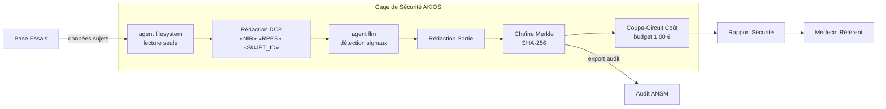

<header class="post-header">
  <div class="post-meta">10 Février 2026 · Ingénierie / Pharmaceutique · 5 min de lecture</div>
  <h1>IA Sandboxée pour la Pharma : Accélérer les Essais Cliniques sous Contrôles Réglementaires</h1>
  <div class="post-author">
    
    <span>AJ</span>
  </div>
</header>

<div class="post-content">

Les entreprises pharmaceutiques dépensent en moyenne 2,6 milliards d'euros et 10 à 15 ans pour mettre un seul médicament sur le marché. L'IA peut compresser ce délai — en analysant les données d'essais, en identifiant les événements indésirables et en optimisant les cohortes de patients. Le problème : **les données d'essais cliniques contiennent les informations de santé les plus sensibles qui soient, et les régulateurs exigent une reproductibilité complète.**

AKIOS résout cela avec la Cage de Sécurité : un runtime éphémère et sandboxé où l'IA traite les données d'essais sous des politiques strictes définies par le code.

## Le Cadre Réglementaire

L'industrie pharmaceutique en Europe est soumise à un cadre réglementaire étroitement imbriqué :

- **RGPD (Art. 9)** — Les données de santé des participants aux essais sont des données sensibles. Tout traitement IA doit respecter des bases légales renforcées, la minimisation des données et les droits des personnes.
- **EU AI Act** — Les systèmes IA utilisés dans la recherche clinique et la pharmacovigilance sont classés haut risque : supervision humaine, transparence et évaluation de conformité obligatoires.
- **Loi Jardé / Règlement Européen 536/2014** — La recherche impliquant la personne humaine exige la confidentialité des participants, l'intégrité des données et la supervision de l'investigateur pour toute analyse automatisée.
- **ANSM (Agence Nationale de Sécurité du Médicament)** — Le régulateur français impose une traçabilité complète des analyses automatisées dans les soumissions réglementaires.

AKIOS applique ces exigences au niveau du runtime — l'agent IA n'opère jamais en dehors du périmètre de conformité.

## Le Flux de Travail : Analyse de Données d'Essais Cliniques

1. **Ingestion** : Les données d'essais (événements indésirables, résultats de laboratoire, résultats patients) sont chargées dans la Cage de Sécurité. Les identifiants patients, codes de site et détails des investigateurs sont anonymisés avant que l'IA ne les voie.
2. **La Cage** : AKIOS s'initialise avec la politique pharma : isolation réseau, aucune persistance de données, exigences de signature électronique et journalisation d'audit conforme aux BPC.
3. **Analyse** : L'agent IA sandboxé examine les données d'essais pour détecter les signaux de sécurité — clustering d'événements indésirables, schémas de valeurs de laboratoire inattendus, tendances d'efficacité — en utilisant uniquement des données anonymisées.
4. **Rapport** : Les résultats sont structurés en rapports prêts pour la soumission réglementaire avec intervalles de confiance, méthodes statistiques et preuves à l'appui. L'IA ne peut pas modifier les enregistrements d'essais.
5. **Audit** : Chaque inférence, accès aux données et sortie est signé cryptographiquement dans une chaîne Merkle. Les auditeurs de l'ANSM peuvent vérifier le chemin d'analyse complet.

### Architecture



## Pourquoi C'est Important

- **Zéro Fuite de Données** : Les identifiants patients sont supprimés avant tout traitement IA. Le modèle ne voit jamais qui est un patient — uniquement des résultats cliniques anonymisés.
- **Conformité EU AI Act** : Chaque sortie IA inclut une traçabilité complète et est stockée dans des journaux d'audit inviolables qui satisfont les exigences d'inspection de l'ANSM.
- **Analyse Reproductible** : Le runtime déterministe de la Cage de Sécurité permet de reproduire exactement toute analyse des mois ou des années plus tard pour un audit réglementaire.
- **Délais Accélérés** : L'IA peut scanner des milliers de rapports d'événements indésirables en minutes, détectant des signaux de sécurité qui prendraient des semaines aux réviseurs humains.

## Essayez-le Vous-même

```bash
pip install akios
akios init my-project
akios run templates/file_analysis.yml
```

Sécurisez votre IA. Construisez avec AKIOS.

</div>

<div class="post-footer">
  <a href="./">← Retour aux études de cas</a>
</div>
