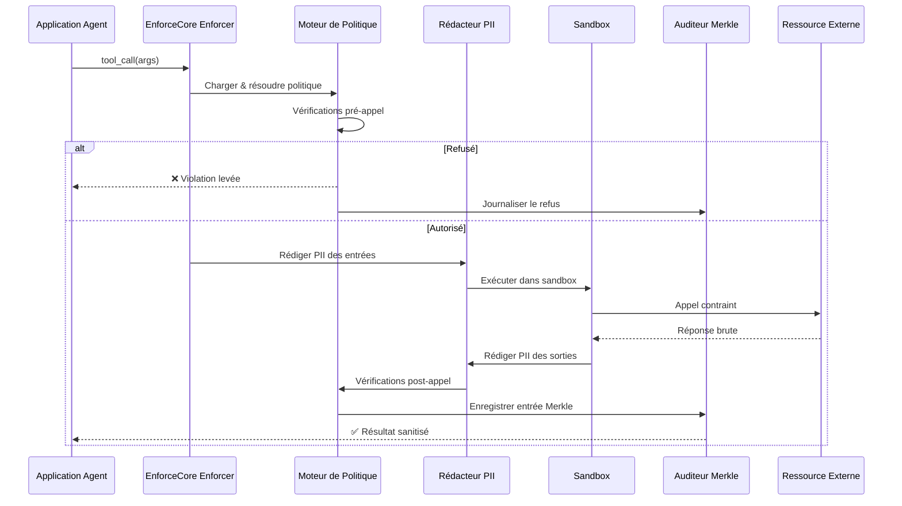
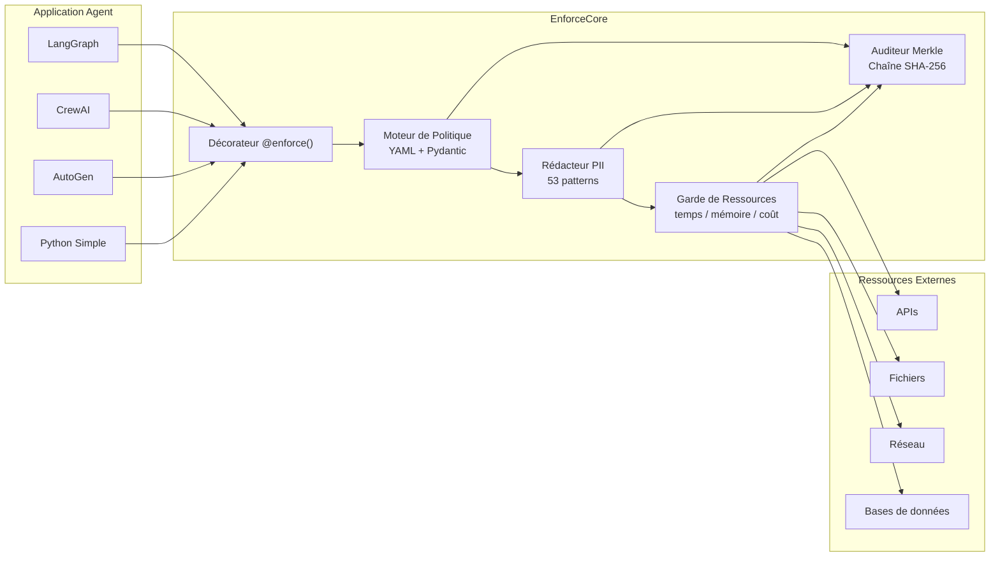
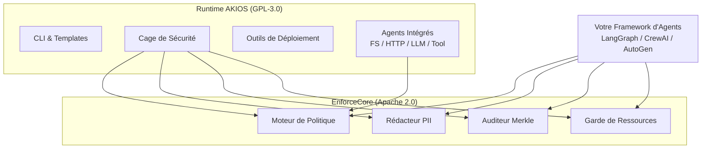

# EnforceCore

<div style="text-align: center; margin: 2rem 0;">
  
</div>

**Enforcement runtime pour agents IA. Open source. Indépendant du framework. Apache 2.0.**

EnforceCore est le framework d'enforcement open-source qui alimente [AKIOS](index.html). Il fournit une application obligatoire des politiques à chaque frontière d'appel externe — appels d'outils, appels API, accès fichiers, accès réseau — de sorte que les violations deviennent structurellement impossibles, pas simplement découragées.

## Le Problème

Chaque framework d'agents majeur — LangGraph, CrewAI, AutoGen, Semantic Kernel — construit des agents de plus en plus capables. Mais presque personne ne construit la **couche de contrôle**.

Aujourd'hui, lorsqu'un agent appelle un outil, il n'existe aucun moyen standard de :
- Appliquer ce qu'il est autorisé à faire **avant** l'exécution de l'appel
- Vérifier ce qu'il **a réellement fait** après le retour de l'appel
- Prouver à un régulateur ou auditeur que les violations étaient **structurellement impossibles**

La plupart des solutions de "sécurité" sont des garde-fous au niveau des prompts — des suggestions au LLM qui peuvent être contournées, ignorées ou jailbreakées. Elles opèrent au mauvais niveau.

**EnforceCore opère à la frontière du runtime — le seul niveau qui ne peut pas être contourné.**

## Démarrage Rapide

Protégez n'importe quelle fonction d'appel d'outil avec un décorateur et une politique YAML :

```python
from enforcecore import enforce

@enforce(policy="my_policy.yaml")
async def call_external_api(url: str, data: dict):
    return await httpx.post(url, json=data)
```

**Fichier de politique (`my_policy.yaml`) :**
```yaml
name: api_access_policy
version: "1.0"
rules:
  - action: http_request
    allow:
      domains: ["api.example.com"]
      methods: ["GET", "POST"]
    deny:
      domains: ["*"]
    redact:
      inputs: true
      outputs: true
```

Chaque appel à `call_external_api` passe désormais par l'évaluation de politique, la rédaction PII, les contraintes de ressources et la journalisation d'audit cryptographique — automatiquement.

## Comment Ça Fonctionne



### Architecture des Composants



## Composants Principaux

### Moteur de Politique
Politiques YAML déclaratives validées par Pydantic. Définissez ce que les agents peuvent et ne peuvent pas faire — évalué à chaque frontière d'appel. Supporte la composition de politiques : hériter, remplacer, fusionner.

### Rédacteur PII
Détection et rédaction en temps réel sur les entrées et sorties. Stratégies configurables : masquer, hacher, supprimer, ou placeholder. Basé sur Microsoft Presidio avec des objectifs de performance honnêtes (5–50ms selon la longueur du contenu).

### Auditeur Merkle
Piste d'audit Merkle SHA-256 pour chaque appel appliqué. Stockage JSONL avec vérification infalsifiable. Chaque entrée est cryptographiquement chaînée à la précédente.

### Garde de Ressources
Limites de ressources multi-plateformes : temps, mémoire, coût. Durcissement complet sur Linux (seccomp/cgroups), signaux POSIX sur macOS, timeout de threads sur Windows. Kill-switch automatique lorsque les limites sont dépassées.

## Principes Fondamentaux

1. **Appliquer, ne pas suggérer** — Les politiques sont obligatoires, pas consultatives. Si un appel viole la politique, il est bloqué.
2. **Frontière d'abord** — L'enforcement se produit à la frontière d'appel, pas à l'intérieur du LLM ou après coup.
3. **Vérifier, ne pas faire confiance** — Chaque appel appliqué produit une entrée d'audit cryptographique. La piste complète est vérifiable par arbre de Merkle.
4. **Échouer fermé** — Si la logique d'enforcement échoue elle-même, l'appel est bloqué. Jamais échouer ouvert.
5. **Indépendant du framework** — Pas de verrouillage. Fonctionne partout où Python s'exécute.

## Pourquoi Pas des Garde-Fous au Niveau du Prompt ?

| Approche | Couche | Contournable ? | Auditable ? | Verrouillé au framework ? |
|----------|--------|----------------|-------------|---------------------------|
| Instructions de prompt | Inside LLM | Oui (jailbreaks) | Non | Souvent |
| Filtres de sortie | Après exécution | Dommages déjà faits | Partiellement | Généralement |
| **EnforceCore** | **Frontière d'appel** | **Non** | **Oui (preuves Merkle)** | **Non** |

Les garde-fous de prompt et les filtres de sortie ont leur place. Mais ils ne constituent pas un enforcement. EnforceCore fournit la garantie structurelle que les régulateurs et les entreprises exigent.

## Relation avec AKIOS



Nous avons conçu EnforceCore comme la fondation d'enforcement qui alimente AKIOS. Plutôt que de construire la logique d'enforcement dans le runtime et de la verrouiller derrière GPL-3.0, nous l'avons construite comme un framework indépendant et polyvalent sous Apache 2.0 — afin que tout l'écosystème puisse en bénéficier.

- **EnforceCore** = la fondation ouverte que nous avons conçue (Apache 2.0, polyvalent, fonctionne avec n'importe quel framework d'agents)
- **AKIOS** = le runtime de production que nous avons construit au-dessus d'EnforceCore (cage de sécurité complète, CLI, outils de déploiement)

Si vous construisez des agents avec LangGraph, CrewAI, AutoGen, ou votre propre système et avez besoin d'enforcement runtime — utilisez EnforceCore directement. Si vous voulez un runtime sécurisé complet avec CLI, templates et outils de déploiement — utilisez AKIOS.

## Installation

```bash
pip install enforcecore

# Avec support de rédaction PII
pip install enforcecore[pii]

# Avec durcissement Linux (seccomp/cgroups)
pip install enforcecore[linux]

# Tout
pip install enforcecore[all]
```

**Prérequis :** Python 3.11+

## Intégrations de Frameworks

EnforceCore fournit des adaptateurs légers (~20–50 lignes chacun) pour les principaux frameworks d'agents :

| Framework | Statut | Intégration |
|-----------|--------|-------------|
| **LangGraph** | Prévu | Wrapper d'outil |
| **CrewAI** | Prévu | Décorateur de tâche |
| **AutoGen** | Prévu | Intercepteur d'appel de fonction |
| **Python Simple** | Disponible | Décorateur `@enforce()` |

## Cas d'Usage

**Conformité EU AI Act** — Les systèmes IA à haut risque doivent démontrer des protections techniques au runtime. EnforceCore fournit un enforcement mesurable, prouvable et auditable.

**Déploiement d'Agents en Entreprise** — Garantissez que les agents ne peuvent pas exfiltrer de données, dépasser les budgets de coût ou accéder à des ressources non autorisées.

**Gouvernance Multi-Agents** — Lorsque l'Agent A appelle l'Agent B qui appelle l'Agent C — EnforceCore se trouve à chaque frontière de cette chaîne.

**Recherche** — Une fondation commune pour étudier la vérification runtime, le sandboxing et les garanties formelles dans les systèmes agentiques.

## Performance

EnforceCore est conçu pour les charges de production avec des objectifs de performance honnêtes :

| Composant | Surcharge |
|-----------|-----------|
| Évaluation de politique | < 1ms |
| Rédaction PII (texte court) | 5–15ms |
| Rédaction PII (texte long) | 15–50ms |
| Entrée d'audit | < 1ms |
| Configuration garde de ressources | < 2ms |
| **Total (appel typique)** | **8–20ms** |

## Liens

- **GitHub :** [github.com/akios-ai/enforcecore](https://github.com/akios-ai/enforcecore)
- **PyPI :** [pypi.org/project/enforcecore](https://pypi.org/project/enforcecore/)
- **Licence :** Apache 2.0

## En Savoir Plus

- **[Démarrage Rapide AKIOS](quickstart.html)** — Voir EnforceCore en action dans AKIOS
- **[Fonctionnalités de Sécurité](security.html)** — Plongée profonde dans les couches de sécurité fournies par EnforceCore
- **[Communauté](../community.html)** — Rejoignez la discussion
