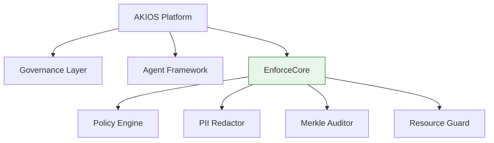

# EnforceCore

**Framework d'enforcement runtime pour agents IA.**

EnforceCore intercepte chaque appel externe de votre agent — appels d'outils, requêtes API, accès fichiers — et applique des vérifications obligatoires avant l'exécution.

---

## Le Problème

Les agents IA effectuent des actions dans le monde réel : appeler des APIs, exécuter du code, accéder à des fichiers. Mais les systèmes d'« alignement » actuels sont des suggestions au LLM — contournables par injection de prompt, jailbreaks ou simplement par dérive.

Il n'y a pas de couche d'enforcement runtime dans la stack d'agents standard.

EnforceCore comble cette lacune. Politiques obligatoires. Rédaction automatique des données personnelles. Journal d'audit inviolable. Le tout appliqué au niveau du code, pas au niveau du prompt.

---

## Démarrage Rapide

```bash
pip install enforcecore
```

```python
from enforcecore import enforce

@enforce(policy="policy.yaml")
async def search_web(query: str) -> str:
    return await api.search(query)
```

Un outil refusé ne s'exécute jamais. Les données personnelles sont redactées automatiquement. Chaque appel produit une entrée d'audit chaînée par Merkle.

Consultez le [Démarrage Rapide complet](/fr/enforcecore/quickstart.html) pour le tutoriel étape par étape.

---

## Principes Fondamentaux

| Principe | Signification |
|---|---|
| **Enforce, pas suggérer** | Les politiques sont obligatoires — un appel refusé ne s'exécute jamais |
| **Fail-closed** | Si l'enforcement échoue, l'appel est bloqué — jamais autorisé |
| **Frontière d'appel** | L'enforcement s'applique au point d'appel externe — la seule couche non contournable |
| **Vérifiable** | 1 510 tests, 22 invariants formels, pistes d'audit chaînées Merkle |
| **Léger** | ~0,056 ms de surcharge E2E (P50) — négligeable |

---

## Relation avec AKIOS


```mermaid
graph TD
    A[AKIOS Platform] --> B[Governance Layer]
    A --> C[Agent Framework]
    A --> D[EnforceCore]
    D --> E[Policy Engine]
    D --> F[PII Redactor]
    D --> G[Merkle Auditor]
    D --> H[Resource Guard]
    style D fill:#e8f5e9,stroke:#2e7d32
```

EnforceCore est la couche d'enforcement runtime de la plateforme AKIOS. Il peut être utilisé de façon autonome ou intégré dans un pipeline AKIOS complet. AKIOS fournit l'orchestration, la gouvernance et les outils de développement — EnforceCore fournit la couche de contrôle qui s'assure que tout agent respecte ses contraintes.

---

## Installation

```bash
pip install enforcecore
```

Python 3.11+ requis. Dépendances : Pydantic v2, PyYAML, structlog, cryptography.

---

## Documentation Complète

| Page | Contenu |
|---|---|
| [Vue d'ensemble](/fr/enforcecore/) | Introduction, composants, pourquoi EnforceCore |
| [Architecture](/fr/enforcecore/architecture.html) | Pipeline, conception, invariants formels, modèle de menaces |
| [Référence API](/fr/enforcecore/api-reference.html) | Toutes les API, exceptions, CLI, variables d'environnement |
| [Démarrage Rapide](/fr/enforcecore/quickstart.html) | Tutoriel pas à pas en 5 minutes |
| [Suite d'Évaluation](/fr/enforcecore/evaluation.html) | 20 scénarios adversariaux, 15 benchmarks |
| [Intégrations](/fr/enforcecore/integrations.html) | LangGraph, CrewAI, AutoGen |
| [Dépannage](/fr/enforcecore/troubleshooting.html) | Erreurs courantes, débogage, FAQ |
| [Feuille de Route](/fr/enforcecore/roadmap.html) | Versions, état actuel, directions futures |
