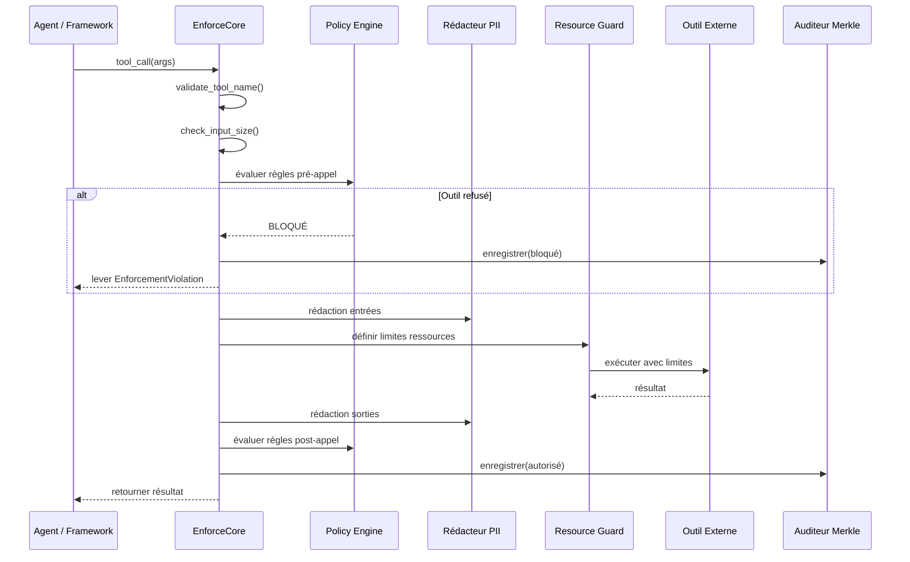

# Architecture

EnforceCore est conçu autour d'une idée centrale : **l'enforcement à la frontière d'appel**.

Chaque fois qu'un agent effectue un appel externe — invoquer un outil, accéder à une API, lire un fichier — cet appel passe par un point d'enforcement. À ce point, les politiques sont évaluées, les données sont redactées, les ressources sont contraintes et une entrée d'audit est enregistrée.

---

## Pipeline d'Enforcement



---

## Composants Principaux

### 1. Enforcer (Coordinateur)

L'orchestrateur central. Intercepte les appels externes, coordonne tous les composants de protection.

- Fournit le décorateur `@enforce()` et le context manager `enforce()`
- Coordonne le pipeline : pré-appel → exécution → post-appel
- Supporte les patterns sync et async
- Lève `EnforcementViolation` en cas de violation

### 2. Policy Engine

Charge, valide et évalue les politiques déclaratives.

- Politiques YAML validées par des schémas Pydantic v2
- Conditions pré-appel et post-appel
- Composition de politiques (héritage, surcharge, fusion)

### 3. Rédacteur PII

Détection et rédaction de données personnelles en temps réel.

- **5 catégories :** email, téléphone, SSN, carte de crédit, adresse IP
- **4 stratégies :** placeholder, masque, hash, suppression
- **Regex compilées** — aucune dépendance NLP lourde
- **~0.1–0.5ms par appel**
- **Protection unicode** — normalisation NFC, détection d'homoglyphes

### 4. Auditeur Merkle

Pistes d'audit inviolables et vérifiables cryptographiquement.

- Chaîne Merkle SHA-256 liant chaque entrée à la précédente
- Entrées d'audit à 14 champs
- Continuité de chaîne inter-sessions
- Détection de falsification

### 5. Resource Guard

Contraintes de ressources multi-plateformes.

| Fonctionnalité | Linux | macOS | Windows |
|---|---|---|---|
| Limites de temps | ✓ | ✓ | ✓ |
| Limites mémoire | ✓ (RLIMIT_AS) | ~ (consultatif) | ✗ |
| Suivi des coûts | ✓ | ✓ | ✓ |
| KillSwitch | ✓ | ✓ | ✓ |

---

## Structure des Modules

```
enforcecore/
├── core/           ← Types, politique, enforcer, config
├── redactor/       ← Détection et rédaction PII
├── auditor/        ← Merkle, journal, vérificateur
├── guard/          ← Plateforme, ressources, killswitch
├── integrations/   ← LangGraph, CrewAI, AutoGen
├── eval/           ← Suite d'évaluation
└── __init__.py     ← API publique (68 exports)
```

---

## Gestion des Erreurs

```
EnforceCoreError (base)
├── PolicyError
│   ├── PolicyLoadError
│   └── PolicyValidationError
├── EnforcementViolation
│   ├── ToolDeniedError
│   ├── CostLimitError
│   └── ResourceLimitError
├── RedactionError
├── AuditError
├── HardeningError
│   ├── InvalidToolNameError
│   ├── InputTooLargeError
│   └── EnforcementDepthError
└── GuardError
```

**Principe clé :** Les échecs d'enforcement **ferment toujours** (bloquent l'appel). Si le Policy Engine plante, l'appel est bloqué. Sécurité par défaut.

---

## Performance

| Composant | Surcharge |
|---|---|
| Évaluation de politique | < 1ms |
| Rédaction PII (entrée courte) | 0.1–0.5ms |
| Création d'entrée d'audit | < 1ms |
| Configuration du guard | < 2ms |
| **Total typique** | **8–20ms** |

Négligeable par rapport à la latence des appels d'outils (100ms–10s).
