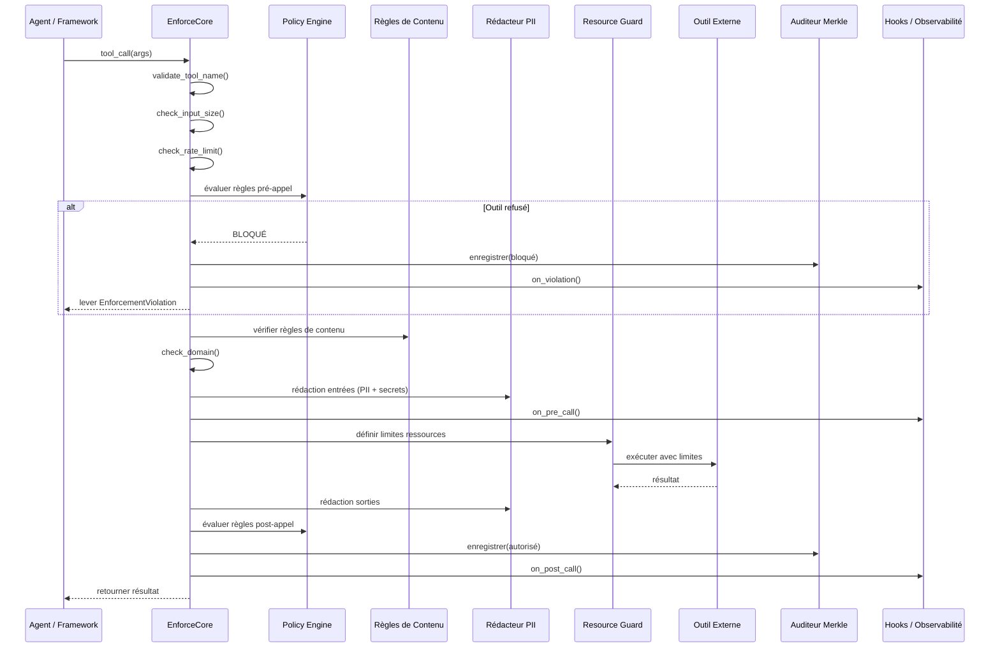

# Architecture

EnforceCore est conçu autour d'une idée centrale : **l'enforcement à la frontière d'appel**.

Chaque fois qu'un agent effectue un appel externe — invoquer un outil, accéder à une API, lire un fichier — cet appel passe par un point d'enforcement. À ce point, les politiques sont évaluées, les données sont redactées, les ressources sont contraintes et une entrée d'audit est enregistrée.

C'est fondamentalement différent des garde-fous au niveau du prompt (qui peuvent être piratés), des filtres de sortie (qui opèrent après les dégâts) ou des pare-feux réseau (qui opèrent à la mauvaise granularité pour les appels d'outils d'agents).

---

## Pipeline d'Enforcement


```mermaid
sequenceDiagram
    participant Agent as Agent / Framework
    participant EC as EnforceCore
    participant Policy as Policy Engine
    participant Rules as Règles de Contenu
    participant Redactor as Rédacteur PII
    participant Guard as Resource Guard
    participant Tool as Outil Externe
    participant Auditor as Auditeur Merkle
    participant Hooks as Hooks / Observabilité

    Agent->>EC: tool_call(args)
    EC->>EC: validate_tool_name()
    EC->>EC: check_input_size()
    EC->>EC: check_rate_limit()
    EC->>Policy: évaluer règles pré-appel
    alt Outil refusé
        Policy-->>EC: BLOQUÉ
        EC->>Auditor: enregistrer(bloqué)
        EC->>Hooks: on_violation()
        EC-->>Agent: lever EnforcementViolation
    end
    EC->>Rules: vérifier règles de contenu
    EC->>EC: check_domain()
    EC->>Redactor: rédaction entrées (PII + secrets)
    EC->>Hooks: on_pre_call()
    EC->>Guard: définir limites ressources
    Guard->>Tool: exécuter avec limites
    Tool-->>Guard: résultat
    EC->>Redactor: rédaction sorties
    EC->>Policy: évaluer règles post-appel
    EC->>Auditor: enregistrer(autorisé)
    EC->>Hooks: on_post_call()
    EC-->>Agent: retourner résultat
```

---

## Composants Principaux

### 1. Enforcer (Coordinateur)

L'orchestrateur central. Intercepte les appels externes, coordonne tous les composants de protection.

- Fournit le décorateur `@enforce()` et la factory `Enforcer.from_file()`
- Coordonne le pipeline : pré-appel → exécution → post-appel
- Supporte les patterns sync et async
- Lève `EnforcementViolation` en cas de violation
- **Hooks de cycle de vie** — callbacks via `@on_pre_call`, `@on_post_call`, `@on_violation`, `@on_redaction`
- **Détection de fuites** — `guard.leaked_thread_count` suit les threads orphelins

```python
# Pattern décorateur
@enforce(policy="policy.yaml")
async def async_tool(args): ...

# Pattern factory
enforcer = Enforcer.from_file("policy.yaml")
result = enforcer.run(my_tool, args)
```

### 2. Policy Engine

Charge, valide et évalue les politiques déclaratives.

- Politiques YAML validées par des schémas Pydantic v2
- Conditions pré-appel et post-appel
- Composition de politiques (héritage, surcharge, fusion)

```yaml
name: "politique-agent"
version: "1.0"
rules:
  allowed_tools: ["search_web", "calculator"]
  denied_tools: ["execute_shell"]
  pii_redaction:
    enabled: true
    categories: [email, phone, ssn, credit_card, ip_address]
  content_rules:
    enabled: true
    categories: [shell_injection, path_traversal, sql_injection, code_execution]
  rate_limits:
    global_rpm: 60
  network:
    allowed_domains: ["api.example.com"]
    denied_domains: ["*.malicious.io"]
  resource_limits:
    max_call_duration_seconds: 30
    max_cost_usd: 5.00
on_violation: "block"
```

### 3. Rédacteur PII

Détection et rédaction en temps réel sur entrées et sorties.

- **5 catégories :** email, téléphone, SSN, carte de crédit, adresse IP
- **4 stratégies :** placeholder (`<EMAIL>`), masque, hash, suppression
- **Regex compilées** — aucune dépendance NLP lourde (pas de spaCy, pas de Presidio)
- **~0,1–0,5 ms par appel**
- **Protection unicode** — normalisation NFC, détection d'homoglyphes (~40 confusables), décodage URL/HTML
- **Scanner de secrets** — 11 catégories intégrées pour la détection de credentials
- **Patterns personnalisés** — `PatternRegistry` pour les détecteurs spécifiques au domaine

### 4. Auditeur Merkle

Pistes d'audit inviolables et vérifiables cryptographiquement.

- Chaîne Merkle SHA-256 liant chaque entrée à la précédente
- 14 champs d'audit (outil, politique, décision, timing, compteurs de rédaction, hashes)
- Continuité de chaîne inter-sessions
- Détection de falsification
- **Append-only au niveau OS** — `Auditor(immutable=True)` définit `chattr +a` (Linux) ou `chflags uappend` (macOS), empêchant la troncature ou la reconstruction de chaîne même par le propriétaire du fichier
- **Witness à hash uniquement** — `Auditor(witness=...)` publie les hashes vers un backend séparé (`CallbackWitness`, `FileWitness`, `LogWitness`), permettant la détection de falsification même si un attaquant reconstruit la chaîne Merkle
- **`verify_with_witness()`** — vérifie les hashes de la piste contre les enregistrements witness
- **Piloté par settings** — activer via `ENFORCECORE_AUDIT_IMMUTABLE=true` et `ENFORCECORE_AUDIT_WITNESS_FILE=/path` sans modifier le code

### 5. Resource Guard

Contraintes de ressources multi-plateformes et terminaison forcée.

| Fonctionnalité | Linux | macOS | Windows |
|---|---|---|---|
| Limites de temps | ✓ | ✓ | ✓ |
| Limites mémoire | ✓ (RLIMIT_AS) | ~ (RLIMIT_RSS, consultatif) | ✗ |
| Suivi des coûts | ✓ | ✓ | ✓ |
| KillSwitch | ✓ | ✓ | ✓ |

### 6. Moteur de Règles de Contenu

Détection de contenu dangereux dans les arguments et sorties des outils.

- **4 catégories intégrées :** injection shell, traversée de chemin, injection SQL, exécution de code
- **Règles personnalisées** — `ContentRule` pour les patterns spécifiques au domaine

### 7. Rate Limiter

Limitation globale et par outil avec compteurs à fenêtre glissante. Thread-safe.

### 8. Enforcement Réseau

Contrôles allow/deny au niveau domaine pour les appels réseau sortants. Supporte les wildcards.

### 9. Système de Hooks

4 points de hook : `@on_pre_call`, `@on_post_call`, `@on_violation`, `@on_redaction`. Compatible async.

### 10. Observabilité

Intégration OpenTelemetry et dispatch d'événements par webhooks.

---

## Structure des Modules

```
enforcecore/
├── core/           ← Types, politique, enforcer, config
├── redactor/       ← Détection PII, stratégies, secrets, patterns
├── auditor/        ← Merkle, journal, vérificateur, backends, witness, immutable, rotation
├── guard/          ← Plateforme, ressources, killswitch
├── rules/          ← Moteur de règles, builtins, rate limiter
├── network/        ← Vérificateur de domaines
├── hooks/          ← Registre de hooks, décorateurs
├── observability/  ← Métriques OTel, spans, webhooks
├── integrations/   ← LangGraph, CrewAI, AutoGen
├── eval/           ← Suite d'évaluation (20 scénarios, 15 benchmarks)
├── cli/            ← Commandes CLI
└── __init__.py     ← API publique (30 Tier 1 + 80 Tier 2)
```

---

## Gestion des Erreurs

La hiérarchie complète des exceptions est documentée dans la [Référence API](api-reference.html#hierarchie-des-exceptions). Principe clé : les échecs d'enforcement **ferment toujours** (bloquent l'appel). Si le Policy Engine plante, l'appel est bloqué. Sécurité par défaut.

---

## Décisions de Conception

### Fail-closed par défaut
Si quelque chose échoue pendant l'enforcement, l'appel est bloqué — jamais autorisé. Le paramètre `fail_open` existe uniquement pour le développement.

### Thread safety
- Cache de politiques avec `threading.Lock`
- Auditeur avec journal append-only thread-safe et verrouillage de fichier
- Suivi de portée avec `contextvars.ContextVar` (async-safe)

### Pas de dépendances lourdes
- Détection PII par regex compilées, pas spaCy ni Presidio
- Validation de politiques par Pydantic v2
- Audit par `hashlib` stdlib (SHA-256)

---

## Performance

Pour les benchmarks complets par composant (15 benchmarks avec P50/P99/P99.9), voir la [Suite d'Évaluation](evaluation.html). Résumé :

| Pipeline | P50 (ms) | P99 (ms) |
|---|---|---|
| **E2E complet (sans PII)** | **0,056** | **0,892** |
| **E2E + rédaction PII** | **0,093** | **0,807** |

Négligeable par rapport à la latence des appels d'outils (100 ms–10 s). Benchmarké sur Python 3.13, 1 000 itérations avec 100 d'échauffement. Exécutez `enforcecore eval` pour reproduire sur votre matériel.

---

## Invariants Formels

EnforceCore spécifie 22 invariants formels organisés en quatre sous-systèmes. Ils sont vérifiés à chaque exécution CI via [Hypothesis](https://hypothesis.readthedocs.io/) — propriétés universellement quantifiées testées contre des milliers d'entrées aléatoires.

> **Note :** Ces invariants sont vérifiés *empiriquement* via des tests basés sur les propriétés, pas mécaniquement prouvés par des prouveurs de théorèmes. Les tests basés sur les propriétés fournissent une haute confiance mais ne constituent pas une preuve mathématique.

| Catégorie | Nombre | Invariants |
|---|---|---|
| **Policy Engine** (P1–P8) | 8 | Déterminisme, enforcement deny, enforcement allowlist, priorité deny-sur-allow, open-par-défaut, closed-sur-vide, merge union, complétude de décision |
| **Chaîne Merkle** (M1–M5) | 5 | Déterminisme de hash, sensibilité de hash, validité de chaîne, détection de falsification, stabilité append |
| **Rédacteur** (R1–R5) | 5 | Idempotence, complétude, sûreté, cohérence détection-rédaction, indépendance de stratégie |
| **Enforcer** (E1–E4) | 4 | Fail-closed, pass-through autorisé, idempotence d'enforcement, propagation d'erreur interne |

**Invariants sélectionnés (notation formelle) :**

- **P2 (Deny Enforcement) :** $\forall$ politique $\pi$, $\forall$ outil $t \in \pi$.denied\_tools : evaluate($\pi$, $t$).decision = BLOCKED
- **P4 (Priorité Deny) :** $\forall$ outil $t \in \pi$.denied\_tools $\cap$ $\pi$.allowed\_tools : evaluate($\pi$, $t$).decision = BLOCKED — deny l'emporte toujours sur allow
- **M4 (Détection de Falsification) :** $\forall$ chaîne valide, $\forall$ modification (changement, suppression, réordonnancement) : verify\_trail().is\_valid = False
- **E1 (Fail-Closed) :** $\forall$ outil refusé $t$ : enforce\_sync($f$, tool\_name=$t$) lève EnforcementViolation
- **R1 (Idempotence) :** $\forall$ texte $s$ : redact(redact($s$)) = redact($s$)

Voir le [document d'invariants formels](https://github.com/akios-ai/EnforceCore/blob/main/docs/formal/invariants.md) pour la spécification complète.

---

## Modèle de Menaces

EnforceCore documente un modèle de menaces formel avec quatre types d'adversaires :

| Adversaire | Capacité | Défense |
|---|---|---|
| **A1 — LLM Compromis** | Contrôle la sortie du LLM (jailbreak, injection de prompt) | Allowlist/denylist d'outils, règles de contenu, enforcement de domaine, rate limiting, rédaction PII |
| **A2 — Outil Malveillant** | Contrôle la réponse de l'outil (MITM, API compromise) | Rédaction de sortie, règles de contenu, limites de taille de sortie, piste d'audit |
| **A3 — Insider** | Accès en écriture au code ou aux variables d'env | Avertissements fail-open, fichiers d'audit append-only au niveau OS (`immutable=True`), backends witness à hash uniquement, journalisation des settings |
| **A4 — Supply Chain** | Dépendance compromise | Surface de dépendance minimale (4 deps), chargement YAML sécurisé, gardes d'import |

**Propriétés formelles de sécurité :**

- **S1 — Complétude fail-closed :** Chaque appel refusé lève `EnforcementViolation` avant l'exécution
- **S2 — Complétude d'audit :** Chaque appel enforcé (autorisé ou bloqué) produit un `AuditEntry`
- **S3 — Intégrité de chaîne :** Toute modification de la piste d'audit est détectable par `verify_trail()`
- **S4 — Totalité de rédaction :** Toutes les catégories PII configurées sont redactées des entrées et sorties

Voir le [modèle de menaces complet](https://github.com/akios-ai/EnforceCore/blob/main/docs/threat-model.md) dans le dépôt.

---

## Défense en Profondeur

| Couche | Périmètre | Exemples |
|---|---|---|
| **L1 — Réseau** | Périmètre réseau | Pare-feux, VPNs, TLS |
| **L2 — OS / Conteneur** | Isolation de processus | seccomp, AppArmor, SELinux, Docker/gVisor |
| **L3 — Application (EnforceCore)** | Frontière sémantique agent | Allowlist d'outils, rédaction PII, règles de contenu, audit |
| **L4 — Modèle** | Comportement LLM | Prompts système, alignement RLHF, filtrage de sortie |
| **L5 — Humain** | Supervision | Humain dans la boucle, workflows d'approbation, revue d'audit |

EnforceCore opère à **L3** — la couche sémantique applicative. Utilisez les cinq couches ensemble pour un confinement robuste des agents.
