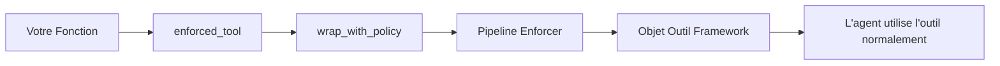

# Intégrations Framework

EnforceCore fournit des adaptateurs prêts à l'emploi pour les frameworks d'agents populaires. Chaque adaptateur remplace le décorateur d'outil du framework par une version avec enforcement.

**Propriétés clés :**
- **Aucune dépendance requise** — les packages framework sont importés à l'appel
- **L'import réussit toujours** — importer le module adaptateur ne génère jamais d'erreur
- **API cohérente** — pattern `@enforced_tool(policy=...)` pour tous les frameworks
- **Enforcement complet** — politique, rédaction PII, guards de ressources, suivi des coûts, audit

---

## LangGraph / LangChain

```python
from enforcecore.integrations.langgraph import enforced_tool

@enforced_tool(policy="policy.yaml")
def search(query: str) -> str:
    """Rechercher des informations sur le web."""
    return web_search(query)

# Avec toutes les options
@enforced_tool(
    policy="policy.yaml",
    tool_name="web_search",
    description="Description personnalisée pour le LLM",
    args_schema=SearchInput,
    return_direct=True,
)
def search(query: str) -> str: ...
```

---

## CrewAI

```python
from enforcecore.integrations.crewai import enforced_tool

@enforced_tool(policy="policy.yaml")
def calculator(expression: str) -> str:
    """Évaluer une expression mathématique."""
    return str(eval(expression))
```

---

## AutoGen

```python
from enforcecore.integrations.autogen import enforced_tool

@enforced_tool(policy="policy.yaml", description="Obtenir la météo")
async def get_weather(city: str) -> str:
    return await weather_api.get(city)
```

---

## Python Pur

Aucun adaptateur nécessaire — utilisez `@enforce()` directement :

```python
from enforcecore import enforce

@enforce(policy="policy.yaml")
async def my_tool(args: dict) -> str:
    return await do_something(args)
```

---

## Construire des Adaptateurs Personnalisés

```python
from enforcecore.integrations import wrap_with_policy

def mon_framework_tool(func, policy):
    """Adaptateur pour MonFramework."""
    enforced = wrap_with_policy(func, policy=policy)
    return MonFramework.register_tool(enforced)
```

| Fonction | Description |
|---|---|
| `require_package(pkg, pip_name=...)` | Vérifier qu'une dépendance optionnelle est installée |
| `wrap_with_policy(func, policy=...)` | Envelopper tout callable avec enforcement |

---

## Fonctionnement

Chaque adaptateur fait ~20–50 lignes de code :

1. Importer le mécanisme d'enregistrement d'outil du framework (paresseux)
2. Envelopper la fonction avec `wrap_with_policy()` pour l'enforcement
3. Enregistrer la fonction protégée avec le système d'outils du framework
4. Retourner le type d'outil attendu par le framework


